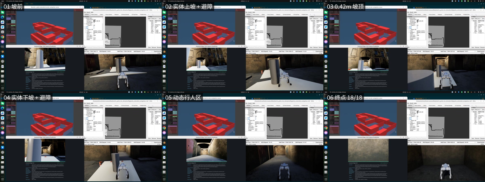
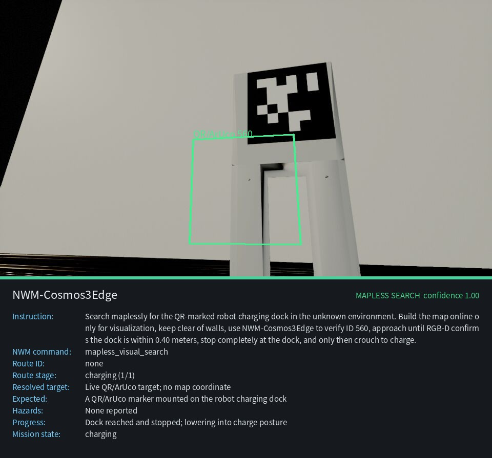

# WAVE-Go

面向 Unitree Go2-W 的世界模型动作适配与可验证执行项目。

[](LICENSE)
[](https://github.com/vigorlee/wave-go/releases)
[](https://github.com/vigorlee/wave-go/releases/tag/v0.2.0-extended-navigation)

## 项目简介

WAVE-Go 将世界模型的高层动作建议与机器人运行时、安全约束和运动控制连接起来，提供可复现实验与证据校验脚本。

- **无图充电**：世界模型生成 nominal action，经几何适配器和 veto-only safety layer 过滤后执行。
- **混合长程导航**：Cosmos3-Edge 选择批准路线，Nav2/RoamerX 负责导航与避障，DreamWaQ 负责机器狗运动控制。

> 仓库不包含 Matrix/HouseWorld、ROS 工作区、CUDA 环境、DreamWaQ 权重或 Cosmos checkpoint。请先准备对应运行时，再使用仓库中的配置和脚本。

## 内容导航

| 内容 | 说明 |
| --- | --- |
| [混合长程导航 Demo](#混合长程导航-demo) | Go2-W + Cosmos3-Edge + Nav2/RoamerX + DreamWaQ |
| [已验证结果](#已验证结果) | 18 段连续任务与物理场景证据 |
| [快速开始](#快速开始) | 环境变量、便携检查与录制命令 |
| [目录结构](#目录结构) | 主要文件位置 |
| [验证方式](#验证方式) | 本地和 ROS 测试 |
| [限制](#限制) | 当前 demo 的边界 |
| [Release](#release) | 视频、结果 JSON 与校验文件 |

## 混合长程导航 Demo

入口目录：[demos/go2w-cosmos-extended-navigation](demos/go2w-cosmos-extended-navigation/)

控制链如下：

```text
Cosmos3-Edge route proposal
            │ approved route
            ▼
Mission Supervisor ──► Nav2 / RoamerX ──► Go2-W base controller
            │                                  │
            └──── evidence + safety checks ◄───┘
                              │
                         DreamWaQ
```

场景包含 18 段连续导航、4 个楼梯/坡道中央圆柱、3 个动态行人，以及实体坡高度变化。详细配置、启动方式和故障排查请参阅 demo 目录中的 [README](demos/go2w-cosmos-extended-navigation/README.md)。

### 可视化结果

下面的连续帧展示了实体 Go2-W 在坡道、中央圆柱和动态行人场景中的导航过程，右下角为机器人视角，左侧为 RViz/场景状态：

<p align="center">
  
</p>

完整视频可在 Release 中查看或下载：

[▶ 播放 extended navigation demo（15 fps）](https://github.com/vigorlee/wave-go/releases/download/v0.2.0-extended-navigation/wave-go-extended-navigation-full-15fps.mp4) · [下载实体坡道片段](https://github.com/vigorlee/wave-go/releases/download/v0.2.0-extended-navigation/wave-go-physical-ramp-excerpt.mp4)

无图充电 Demo 的最终视觉状态：

<p align="center">
  
</p>

## 已验证结果

| 指标 | 结果 |
| --- | ---: |
| 完成阶段 | **18 / 18** |
| `NavigateThroughPoses` | **1** |
| 中间目标重启 | **0** |
| 行驶距离 | 约 **60.15 m** |
| 实体坡高度 | **0.413 → 0.851 → 0.397 m** |
| 动态行人 | **3** |
| 输出视频 | H.264，2560×1440，15 fps，347.134 s |

## 快速开始

```bash
git clone https://github.com/vigorlee/wave-go.git
cd wave-go/demos/go2w-cosmos-extended-navigation

# 按本机实际路径设置运行时
export WAVE_GO_RUNTIME_ROOT=/home/unitree/matrix_go2w_lcm_demo
export COSMOS_VLN_ROOT=/home/unitree/matrix_g1_lcm_demo

# 便携检查（不要求启动完整机器人运行时）
./validate.sh
```

录制完整 demo：

```bash
OUT="$PWD/artifacts/extended_navigation_$(date +%Y%m%d_%H%M%S)"
COSMOS_VLN_ARTIFACT_DIR="$OUT" ./scripts/record_demo.sh
```

## 目录结构

```text
demos/go2w-cosmos-extended-navigation/
├── README.md                 # Demo 说明与运行指南
├── configs/                  # 任务、控制器与安全参数
├── scenes/                   # 场景 XML / JSON
├── cosmos_bridge/            # Cosmos3-Edge 路线桥接
├── mission_supervisor/       # 任务编排与证据记录
├── scripts/                  # start / record / stop / validate
├── tests/                    # 便携测试与 ROS 集成测试
└── evidence/                 # 精简结果与校验信息
```

## 验证方式

在 demo 目录执行：

```bash
./validate.sh
```

如果已安装并配置 ROS 运行时，可执行完整测试：

```bash
WAVE_GO_RUN_ROS_TESTS=1 ./validate.sh
```

当前验证结果为 32 个测试全部通过。脚本会检查配置、场景、桥接接口、任务阶段和证据格式；不会替代真实机器人现场安全检查。

## 限制

- 真实执行依赖外部 ROS、LCM、Nav2/RoamerX、DreamWaQ 和 Cosmos3-Edge 运行时。
- 仓库中的结果文件用于复现和审计，不代表对未列出的硬件、地图或环境条件作出保证。
- 在真实机器人上运行前，请设置急停、限速、碰撞监测和人工接管流程。

## Release

完整演示资产位于 [v0.2.0-extended-navigation](https://github.com/vigorlee/wave-go/releases/tag/v0.2.0-extended-navigation)：

- `wave-go-extended-navigation-full-15fps.mp4`
- `wave-go-physical-ramp-excerpt.mp4`
- `wave-go-extended-navigation-result.json`
- `wave-go-extended-navigation-SHA256SUMS.txt`

下载后可使用 `sha256sum -c wave-go-extended-navigation-SHA256SUMS.txt` 校验文件完整性。

## License

详见 [LICENSE](LICENSE)。
