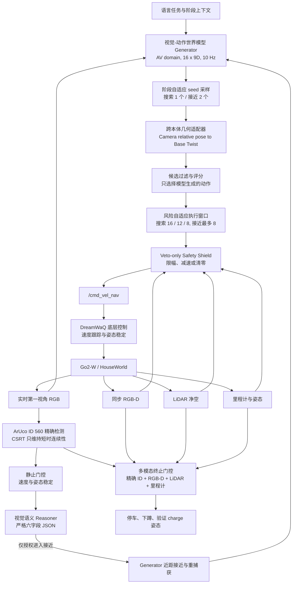
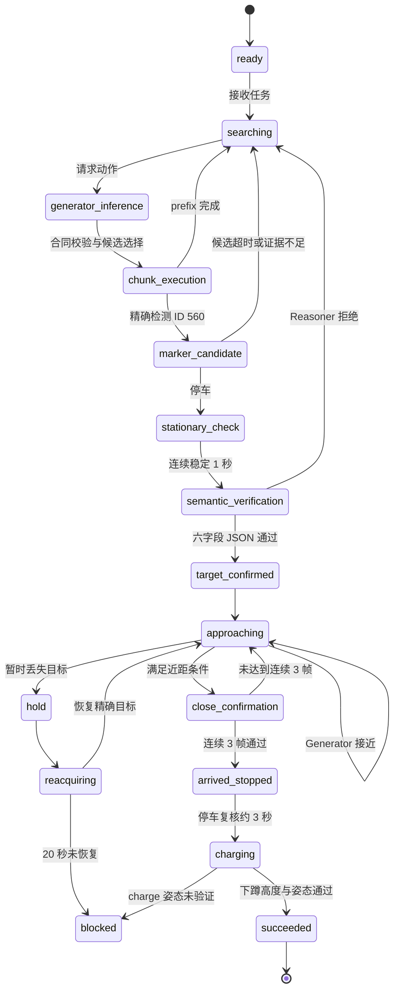

# WAVE-Go

**World-model Action Adaptation with Verified Execution for Go2-W**

WAVE-Go 是一个面向轮足机器人 Go2-W 的无图充电闭环框架。系统使用预训练视觉-动作世界模型，根据实时第一视角图像和语言任务生成短时动作序列，再通过训练无关的跨本体几何适配器转换为 ROS `Twist`。执行过程中，RGB、RGB-D、LiDAR、里程计和姿态反馈持续参与安全否决与终止验证，最终完成充电桩搜索、身份确认、近距离接近、停车和下蹲。

当前实现以 **Cosmos3-Edge** 实例化视觉-动作世界模型，但 WAVE-Go 指的是完整机器人方法，而不是对基础模型的重命名。

> 准确的方法定位：以预训练视觉-动作世界模型作为唯一高层 nominal action source，通过跨本体动作适配、风险自适应 action-chunk 执行和多模态证据门控，完成 map-independent 的充电桩搜索与接近。

## 1. 方法边界

- 高层非零运动只来自世界模型 Generator。
- Safety shield 只能缩小或否决世界模型动作，不能生成替代轨迹。
- 当前控制链不使用 Nav2、A*、RRT、DWA、TEB、MPC 或 DP planner。
- 在线 SLAM 只用于可视化和实验记录；运动控制器不读取 `/map`。
- 当前 checkpoint 没有 Go2-W action domain，也没有经过 Go2-W 专用微调。
- 当前结果验证的是 HouseWorld 固定仿真场景中的运行时未知环境闭环，不构成真实机器人安全保证或跨场景泛化证明。

## 2. 总体技术流程



控制闭环可以概括为：

```text
语言任务 + 实时感知
  -> 世界模型生成 action chunk
  -> AV 相机动作适配为 Go2-W Twist
  -> 候选选择与逐步安全否决
  -> /cmd_vel_nav
  -> DreamWaQ 执行
  -> 新一轮实时感知
```

目标验证链与动作生成链相互独立：

```text
精确 ID 560
  -> 停车稳定
  -> Reasoner 确认“这是充电桩”
  -> 世界模型接近
  -> 连续三帧近距物理证据
  -> 完全停车并持续复核
  -> 下蹲
  -> charge 姿态验证
```

## 3. 核心方法

### 3.1 常驻双接口世界模型服务

`scripts/cosmos3_go2w_generator_server.py` 只加载一次模型，同时提供两个接口：

| 接口 | 作用 | 输出权限 |
| --- | --- | --- |
| `/predict_batch` | 根据图像、任务和 seed 生成动作 | 提供高层 nominal action |
| `/reason` | 判断目标是否为机器人充电桩 | 只提供语义确认，不直接触发运动或下蹲 |

Generator 合同为：

```text
domain       = av
image size   = 256 x 256
action shape = 16 x 9
frequency    = 10 Hz
```

每个 9D 动作由相机相对位移和 6D 旋转表示组成：

\[
a_t = [\Delta p_C,\ r_{6D}] \in \mathbb{R}^{9}.
\]

服务支持确定性的 per-request seed。系统会严格拒绝错误维度、错误 chunk 长度、布尔值伪装的数字、`NaN`、`Inf` 和不满足服务能力合同的响应。

### 3.2 训练无关的跨本体动作适配

基础模型输出采用 AV 光学相机坐标：

```text
+X: right
+Y: down
+Z: forward
```

Go2-W 机身坐标采用：

```text
+X: forward
+Y: left
+Z: up
```

适配器先将 6D 旋转通过 SVD 投影到合法的 \(SO(3)\)，再进行相机到机身的固定坐标变换：

\[
\Delta p_B = T_{B \leftarrow C}\Delta p_C,
\]

\[
R_B = T_{B \leftarrow C}R_CT_{B \leftarrow C}^{\top}.
\]

随后从机身相对位姿提取前进速度和偏航速度：

\[
v_x =
f\,s_t\,\Delta p_{B,x},
\]

\[
\omega_z =
f\left(
s_r\,\operatorname{yaw}(R_B)
+s_l\,\operatorname{atan2}
\left(\Delta p_{B,y},\max(0.05,|\Delta p_{B,x}|)\right)
\right).
\]

其中 \(f=10\) Hz，\(s_t\)、\(s_r\) 和 \(s_l\) 分别是平移、旋转和横向轨迹增益。适配完成后还会执行非负前进约束、速度上限和变化率限制。

这一过程是零样本几何接口，不应描述为 Go2-W policy fine-tuning。

### 3.3 风险自适应 action chunk

模型每次预测 16 个动作。系统按局部净空决定搜索阶段实际执行的 prefix：

| 环境条件 | 搜索 prefix |
| --- | ---: |
| 前方至少 `2.0 m`，两侧至少 `1.20 m` | 16 步 |
| 前方至少 `1.20 m`，两侧至少 `0.73 m` | 12 步 |
| 其他有效净空 | 8 步 |
| 接近、保持和重捕获阶段 | 最多 8 步 |

每步对应约 `0.1 s`。长 chunk 只减少重新请求模型的频率，不等于 1.6 秒开环盲走：

- 每个动作步重新读取 RGB、RGB-D、LiDAR、里程计和姿态；
- 每步重新运行 safety shield；
- 视觉目标出现、传感器过期或姿态异常时立即中断剩余 prefix；
- `/cmd_vel_nav` 命令 TTL 为 `0.20 s`，过期自动失效。

### 3.4 阶段自适应候选采样

候选 seed 配置为 `[0, 2, 3, 5]`：

- 搜索阶段每轮轮换一个 seed，控制推理延迟；
- 接近、保持和重捕获阶段比较前两个 seed；
- 候选先经过适配与 shield，再根据目标对准、净空和动作有效性评分。

评分器只在已经由世界模型生成的候选中选择，不产生新轨迹，因此不是额外 planner。

### 3.5 Veto-only 安全层

Safety shield 使用 LiDAR、RGB-D、里程计、姿态和视觉目标误差约束动作：

- 前方净空不足时禁止平移；
- 靠近侧墙时降低前进速度；
- 朝过近侧墙转向时将偏航动作清零；
- 目标横向误差过大时禁止继续前进；
- 进入 RGB-D 终止距离后禁止前进；
- `approach_hold` 和 `reacquire` 阶段禁止平移；
- 传感器过期、动作非有限数或机器人姿态异常时立即输出零速度；
- 没有可靠后向净空扇区，因此禁止倒车。

安全层的动作权限是非对称的：

```text
允许：保留、减小、限幅、清零世界模型动作
禁止：新增转向、生成弧线、补写倒车、调用传统规划器
```

### 3.6 目标感知与语义验证

目标是 `DICT_4X4_1000` 中的 ArUco ID `560`。感知链包含：

- 原图和地面区域的多尺度 ArUco 检测；
- 暗色底座场景的保守阈值检测；
- 已确认目标区域内的零比特误差 `target_cell_exact` 解码；
- 最多 `4.0 s` 的 CSRT 短时跟踪。

CSRT 只维持视觉连续性，始终标记为 `exact_id=false`。它不能累计最终确认帧、不能替代深度，也不能触发充电。

调用 Reasoner 前，机器人必须连续静止约 `1.0 s`：

```text
linear speed <= 0.03 m/s
yaw rate    <= 0.06 rad/s
```

Reasoner 使用 `1024` token 预算，并要求首先输出且只输出以下六字段 JSON：

```json
{
  "target_visible": true,
  "target_kind": "robot_charging_dock",
  "marker_visible": true,
  "safe_to_approach": true,
  "confidence": 0.9,
  "reason": "brief visual evidence"
}
```

缺字段、多字段、错误类型、非法 `target_kind`、截断响应或不确定目标都会严格拒绝。Reasoner 只回答“目标是什么、是否允许开始接近”，不能回答“机器人是否已经到达”。

### 3.7 权限分离的多模态终止门控

系统把语义权威和物理完成权威分开：

| 证据源 | 可以证明 | 不可以证明 |
| --- | --- | --- |
| Reasoner | 目标语义上是充电桩 | 已到达、可直接下蹲 |
| CSRT | 短时间内目标可能仍在视野中 | 精确 ID、最终到达 |
| ArUco / target-cell | 当前帧目标是 ID 560 | 实际距离和停车状态 |
| RGB-D | 二维码区域的实际距离 | 目标语义身份 |
| LiDAR | 前方碰撞净空 | 充电桩本体距离 |
| 里程计与姿态 | 接近里程、静止和机身稳定 | 目标身份 |

进入 `charging` 前必须同时满足：

- 当前帧精确解码 ID `560`；
- 连续 `3` 组新的 RGB-Depth 同步帧；
- RGB 与 Depth 接收时间差不超过 `0.60 s`；
- 二维码高度占图像至少 `0.10`；
- 水平误差不超过 `0.06`；
- 二维码内部区域 RGB-D 距离在 `0.20-0.40 m`；
- LiDAR 前方净空至少 `0.42 m`；
- 语义确认后累计接近路径至少 `1.20 m`；
- 机器人高度至少 `0.35 m`，roll/pitch 绝对值不超过 `0.30 rad`；
- 完全停车约 `3.0 s`，停车过程中仍持续复核精确 ID 和深度。

任一证据缺失、过期、不同步或格式错误都会 fail closed。

### 3.8 DreamWaQ 底层执行与姿态状态

适配后的命令发布到 `/cmd_vel_nav`，由 Go2-W RL bridge 交给 DreamWaQ 底层策略执行：

- `stand`：普通移动和零速度平衡；
- `recover`：异常姿态下保持零速度并恢复；
- `charge`：到达门控全部通过后执行下蹲轨迹。

当前 Generator 配置的高层标称搜索上限为 `0.90 m/s`，但启动器将 DreamWaQ 实际前进上限固定为 `0.35 m/s`。因此不能把历史实验中的“峰值提高 10 倍”表述为当前端到端速度提高 10 倍。

## 4. 状态机



## 5. 当前技术栈与模块

| 层级 | 技术或文件 | 职责 |
| --- | --- | --- |
| 仿真 | Matrix + HouseWorld + MuJoCo/UE | 场景、机器人和传感器 |
| 通信 | ROS 2 Humble + Zenoh | 图像、点云、里程计、状态和速度命令 |
| 世界模型服务 | `scripts/cosmos3_go2w_generator_server.py` | 常驻 Generator 与 Reasoner |
| 主闭环 | `scripts/go2w_house_mapless_charger_search.py` | 动作适配、候选选择、门控和状态机 |
| 配置 | `config/go2w_house_mapless_search.json` | 模型合同、速度、净空和终止阈值 |
| LiDAR | `scripts/go2w_house_pointcloud_to_laserscan.py` | 点云到 `/scan` |
| SLAM | `slam_toolbox` | 在线建图，仅用于观察 |
| 底层控制 | `controllers/go2w_rl_bridge/src/main.cpp` | DreamWaQ 速度跟踪与姿态控制 |
| 可视化 | `scripts/cosmos_vln_visualizer.py` | 实时画面、状态和检测结果 |
| 启动器 | `scripts/start_go2w_house_navigation.py` | 启停完整运行链 |
| 测试 | `tests/` | Generator、适配器、门控和运行时回归 |

## 6. 是否使用其他 Planner

| 组件 | 当前是否参与高层控制 | 实际作用 |
| --- | ---: | --- |
| Cosmos3-Edge Generator | 是 | 唯一 nominal action source |
| 候选评分器 | 是 | 从模型候选中选择，不生成动作 |
| Safety shield | 是 | 限幅或否决，不生成动作 |
| DreamWaQ | 是 | 底层速度和姿态控制 |
| ArUco / CSRT | 是 | 精确检测与短时跟踪 |
| RGB-D / LiDAR / odometry | 是 | 物理安全与终止证据 |
| 在线 SLAM | 仅可视化 | 控制器不消费 `/map` |
| Nav2 / DWA / TEB | 否 | 当前任务链未使用 |
| A* / RRT / MPC / DP | 否 | 未加入路径或动作生成 |

严谨表述是：

> **planner-free, map-independent high-level control**

不建议写成“系统完全不建图”，因为后台会运行在线 SLAM；更准确的说法是“运动决策不消费地图”。

## 7. 会话中形成的关键工程决策

本项目历史会话 `导航世界模型NWM` 形成了以下稳定版本：

1. 将 AV-domain 9D 相机相对位姿通过几何适配器接入 `/cmd_vel_nav`，让 Go2-W 能实际执行 Generator action。
2. 尝试过更激进的速度、更多 seed 和更长接近 chunk；复测出现墙角和行为退化后，恢复到已成功版本。
3. 当前保留搜索 `16/12/8` 的风险自适应 prefix，接近固定最多 `8` 步，并逐步复核传感器。
4. DreamWaQ 底层前进限幅恢复为 `0.35 m/s`，不沿用实验性 `0.90 m/s` 底层上限。
5. Reasoner 预算提高到 `1024`，强制完整六字段 JSON，取消任何缺字段猜测补全。
6. 目标跟踪与任务完成权限分离，tracker 不得触发最终到达。
7. 成功版本经过完整闭环复测并备份到本仓库。

## 8. 已验证结果

仓库内保存的成功运行证据完成了以下闭环：

```text
started
  -> exact ArUco ID 560
  -> stationary semantic verification
  -> target_confirmed, confidence 0.9
  -> Generator approach
  -> target_cell_exact 3/3
  -> arrived_stopped
  -> charging
  -> succeeded
```

该证据日志中的关键数值：

| 指标 | 结果 |
| --- | ---: |
| `started -> succeeded` | 约 `251.9 s` |
| Reasoner 置信度 | `0.9` |
| 最终累计接近路径 | `3.722 m` |
| 第三帧 RGB-D 距离 | `0.350 m` |
| 进入 charging 时 RGB-D 距离 | `0.354 m` |
| 最终连续精确确认 | `3/3` |
| 最终状态 | `succeeded` |
| 最终姿态 | `charge` |

历史会话在 2026-07-27 又进行了同配置复测，约 `283.6 s` 后再次进入 `succeeded`；该次最终 RGB-D 距离为 `0.357 m`，累计接近路径为 `3.385 m`，下蹲后机身高度约 `0.222 m`，线速度和角速度接近零。

证据文件：

- [完整成功日志](evidence/charger_search_success.log)
- [最终可视化画面](evidence/final_visualization.jpg)

## 9. 论文方法概括

推荐方法名：

> **WAVE-Go — World-model Action Adaptation with Verified Execution**

推荐论文题目：

> **WAVE-Go: Safety-Shielded World-Model Action Adaptation for Mapless Charging of Wheeled Quadrupeds**

三个可验证的主要创新点：

### 9.1 训练无关的跨本体世界模型动作适配

将 AV-domain 相机相对位姿 chunk 通过坐标变换、\(SO(3)\) 投影和受约束的 twist 提取迁移到轮足机器人，无需 Go2-W 专用策略微调。

### 9.2 风险自适应的多样化 action-chunk 闭环执行

根据几何净空和目标不确定性分配 seed 数量与 chunk 长度，在开阔区域延长执行窗口，在高风险区域增加闭环重检并允许逐步中断。

### 9.3 语义权威与物理完成权威分离

Reasoner 只验证任务语义，tracker 只维持短时连续性，最终完成必须由同步的精确 ID、RGB-D、LiDAR、里程计和姿态证据共同授权。

论文中可以把骨干描述为 “a pretrained vision-action world model”，但应在实现细节中明确：

> We instantiate the vision-action backbone using Cosmos3-Edge without Go2-W-specific fine-tuning.

## 10. 运行

完整依赖安装和排障见 [README_MAPLESS_CHARGER_SEARCH.md](README_MAPLESS_CHARGER_SEARCH.md)。

启动 HouseWorld、Go2-W、世界模型服务、在线 SLAM 和无图搜索节点：

```bash
cd /home/unitree/matrix_go2w_lcm_demo
/usr/bin/python3 scripts/start_go2w_house_navigation.py start \
  --onscreen --with-cosmos --rviz --start-timeout 240
```

加载 ROS 环境：

```bash
set +u
source /opt/ros/humble/setup.bash
source genisom_roamerx_open/install/setup.bash
set -u
export RMW_IMPLEMENTATION=rmw_zenoh_cpp
export ROS_DOMAIN_ID=90
export ROS2CLI_NO_DAEMON=1
```

发布任务：

```bash
ros2 topic pub --once /cosmos_vln/charger_search std_msgs/msg/String \
  "{data: 'Search maplessly for the QR-marked robot charging dock in the unknown environment. Build the map online only for visualization, keep clear of walls, use NWM-Cosmos3Edge to verify ID 560, approach until RGB-D confirms the dock is within 0.40 meters, stop completely at the dock, and only then crouch to charge.'}"
```

查看状态：

```bash
ros2 topic echo --full-length /cosmos_vln/charger_search_status
```

停止运行链：

```bash
/usr/bin/python3 scripts/start_go2w_house_navigation.py stop
```

## 11. 测试

本备份仓库包含 98 项聚焦回归测试：

```bash
source /opt/ros/humble/setup.bash
source /path/to/genisom_roamerx_open/install/setup.bash
python3 -m unittest \
  tests.test_go2w_house_generator_action \
  tests.test_go2w_house_mapless_search \
  tests.test_go2w_house_runtime
```

测试覆盖：

- Generator 服务合同与 seed 行为；
- 9D action chunk 形状和有限值校验；
- 6D rotation 到 \(SO(3)\) 的投影；
- AV camera pose 到 Go2-W `Twist` 的适配；
- 动态 prefix、TTL 和推理期间漂移拒绝；
- veto-only safety shield；
- ArUco、CSRT、RGB-D 同步和目标格精确解码；
- 严格六字段 Reasoner JSON；
- 停车、姿态、下蹲和 fail-closed 终止门控。

## 12. 仓库范围

本仓库是成功 demo 的聚焦源码备份，包含：

- `scripts/`：任务运行时、Generator adapter、传感器桥和启动器；
- `config/`：无图搜索、在线 SLAM 和可视化配置；
- `controllers/`：Go2-W DreamWaQ bridge；
- `tests/`：聚焦回归测试；
- `evidence/`：成功日志和最终画面。

以下大文件或机器相关依赖未包含：

- Cosmos 系列模型权重与推理框架；
- Matrix/HouseWorld 仿真资产；
- 外部 ROS 2 工作区及其 `build/`、`install/`、`log/`；
- CUDA/NVIDIA 运行库；
- 运行缓存和临时状态。

因此，本仓库保存的是方法实现、配置、测试与证据，不是开箱即用的完整模型发行包。
