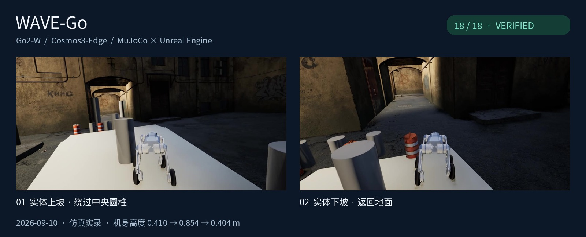
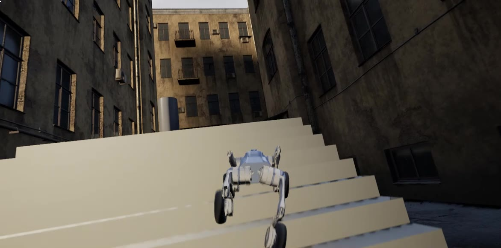
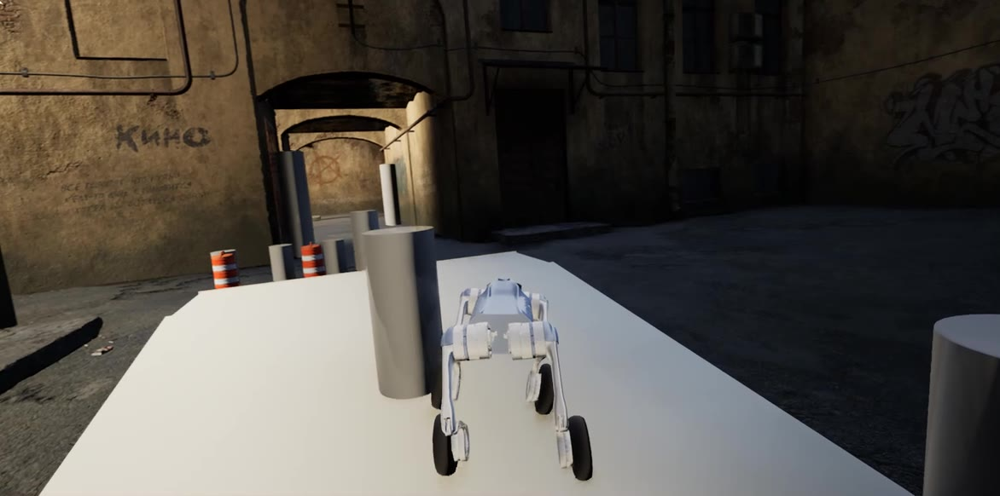
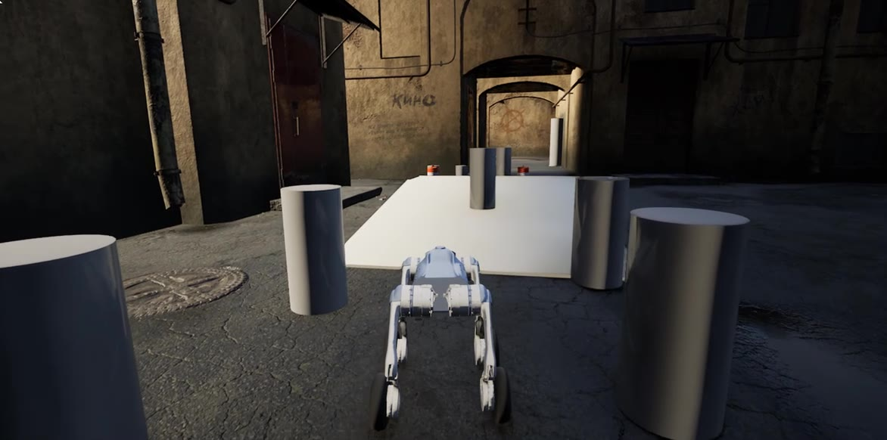
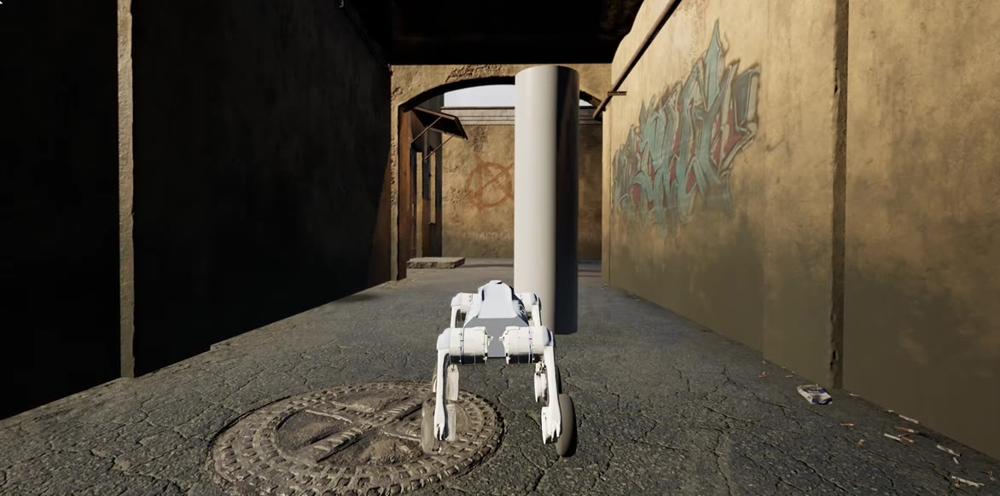

<div align="center">

# WAVE-Go

**世界模型动作适配 · Go2-W 可验证执行**

从高层任务到实体运动，连接世界模型、导航规划与轮足控制。

[](demos/go2w-cosmos-extended-navigation/) [](#三类场景实录) [](#本次复测结果)

[场景实录](#三类场景实录) · [验收指标](#本次复测结果) · [运行指南](#快速开始) · [无图充电](README_MAPLESS_CHARGER_SEARCH.md)

</div>



<p align="center"><sub>来自成功运行的真实仿真录屏。坡道显示与碰撞面已对齐，机身高度随坡面实际升降。</sub></p>

## 三类场景实录

**楼梯障碍 → 双坡道障碍 → 平地圆柱与动态避障。** 以下图片均取自 2026-09-10 同一次完整运行，点击可查看大图。

<table>
<tr>
<td width="50%">
<a href="demos/go2w-cosmos-extended-navigation/evidence/2026-09-10/stairs.jpg"></a>
<br><b>01 · 楼梯与中央圆柱</b><br>
<sub>完成上下楼梯，通过两处楼梯中央圆柱。</sub>
</td>
<td width="50%">
<a href="demos/go2w-cosmos-extended-navigation/evidence/2026-09-10/ramp-up.jpg"></a>
<br><b>02 · 双坡道与中央圆柱</b><br>
<sub>坡道方向修正，实际完成上坡、过顶和下坡。</sub>
</td>
</tr>
<tr>
<td width="50%">
<a href="demos/go2w-cosmos-extended-navigation/evidence/2026-09-10/slalom.jpg"></a>
<br><b>03A · 平地交错圆柱</b><br>
<sub>四个交错圆柱清晰可见，机器人穿过通道进入坡道。</sub>
</td>
<td width="50%">
<a href="demos/go2w-cosmos-extended-navigation/evidence/2026-09-10/dynamic-obstacle.jpg"></a>
<br><b>03B · 动态障碍通行</b><br>
<sub>移动高圆柱代理横穿通道，机器人等待后继续前进。</sub>
</td>
</tr>
</table>

[查看截图来源与验收说明](demos/go2w-cosmos-extended-navigation/evidence/2026-09-10/README.md) · [查看结果 JSON](demos/go2w-cosmos-extended-navigation/evidence/2026-09-10/result-summary.json)

## 本次复测结果

| 连续任务 | 实体上下坡 | 动态通行 |
| :--- | :--- | :--- |
| **18 / 18** 阶段完成 | **+44.5 cm / −45.0 cm** 高度变化 | **1.62 m** 最近中心距离 |
| 约 **60.88 m** 行程 | **4 / 4** 地形圆柱检查通过 | **3 / 3** 动态代理通过 |
| **1** 次导航动作，**0** 次中途重发 | 机身高度 **0.410 → 0.854 → 0.404 m** | 验收线 **≥ 0.65 m** |

本次 `acceptance_passed = true`；完整四窗口录像为 **426.6 s · 2560×1440 · 15 fps**，已通过全片解码检查。动态代理在坡道出口、北侧通道和横廊的最近中心距离分别为 **1.621 / 1.713 / 1.688 m**。

> **版本说明**：上方图片和指标来自 9 月 10 日的本地修复版。本次更新发布截图及验收摘要；仓库现有运行包和 `v0.2.0` Release 仍对应 9 月 3 日版本，不能视为已包含本次全部运行时修复。

## 如何工作


Cosmos3-Edge 在任务开始时选择路线；局部导航与底层运动分别由 Nav2/RoamerX 和 DreamWaQ 执行。9 月 10 日修复版还使用实际仿真关节状态预测动态障碍的横穿窗口。

| 项目方向 | 执行方式 | 文档 |
| :--- | :--- | :--- |
| **混合长程导航** | 高层路线选择 → 导航避障 → 轮足运动 | [Demo 运行指南](demos/go2w-cosmos-extended-navigation/README.md) |
| **无图充电** | 世界模型动作建议 → 几何适配 → 安全过滤 → 执行 | [充电视觉搜索](README_MAPLESS_CHARGER_SEARCH.md) |

<details>
<summary><b>展开查看无图充电结果</b></summary>

<p align="center"></p>

视觉搜索状态：检测到充电桩标记并进入 `charging` 状态。此结果属于独立的无图充电实验。

</details>

## 快速开始

以下命令检查并运行仓库现有的导航包。需先准备 ROS 2、MATRiX/HouseWorld、RoamerX、DreamWaQ 与 Cosmos3-Edge 运行时；仓库不捆绑大型场景资产或模型权重。

```bash
git clone https://github.com/vigorlee/wave-go.git
cd wave-go/demos/go2w-cosmos-extended-navigation

# 按本机实际位置设置外部运行时
export WAVE_GO_RUNTIME_ROOT=/path/to/matrix_go2w_lcm_demo
export COSMOS_VLN_ROOT=/path/to/matrix_g1_lcm_demo

# 静态检查与便携测试
./validate.sh
```

录制现有运行包的完整演示：

```bash
OUT="$PWD/artifacts/extended_navigation_$(date +%Y%m%d_%H%M%S)"
COSMOS_VLN_ARTIFACT_DIR="$OUT" ./scripts/record_demo.sh
```

[完整启动、停止与故障排查](demos/go2w-cosmos-extended-navigation/README.md)

<details>
<summary><b>目录结构与验证方式</b></summary>

```text
demos/go2w-cosmos-extended-navigation/
├── config/       # 路线、参数与 RViz 配置
├── controller/   # Go2-W 控制器说明与源码
├── scene/        # MuJoCo / UE 场景
├── scripts/      # 启动、任务、录制与停止
├── tests/        # 便携与 ROS 测试
├── evidence/     # 历史发布证据
│   └── 2026-09-10/  # 本次成功复测图片与摘要
└── validate.sh
```

在 demo 目录执行 `./validate.sh`。已配置 ROS 的环境可执行：

```bash
WAVE_GO_RUN_ROS_TESTS=1 ./validate.sh
```

静态检查不替代实际场景运行与录像验收。

</details>

## 实验边界

本页展示 **MuJoCo / UE 仿真结果**。动态行人使用移动高圆柱代理，未使用写实人物模型；点云由传感器数据与场景几何融合，动态位置来自实际仿真状态。中心距离是近似包络指标。上述结果不代表未知环境纯视觉导航或真机测试。

## 历史 Release

[v0.2.0-extended-navigation](https://github.com/vigorlee/wave-go/releases/tag/v0.2.0-extended-navigation) 保留 9 月 3 日的原始视频与结果，用于版本追溯：

[完整历史录像](https://github.com/vigorlee/wave-go/releases/download/v0.2.0-extended-navigation/wave-go-extended-navigation-full-15fps.mp4) · [历史坡道片段](https://github.com/vigorlee/wave-go/releases/download/v0.2.0-extended-navigation/wave-go-physical-ramp-excerpt.mp4)

这些历史视频不作为本页 9 月 10 日修复结果的视觉验收。最新截图与机器可读指标见 [2026-09-10 证据目录](demos/go2w-cosmos-extended-navigation/evidence/2026-09-10/)。
