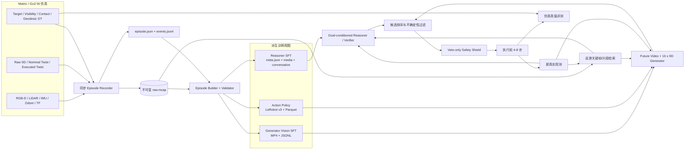

# Cosmos3 导航世界模型：数据采集、训练与 ID/OOD 评测计划

> 文档版本：v1.1
>
> 审计日期：2026-07-28
>
> 适用项目：WAVE-Go / Go2-W / Matrix HouseWorld / Cosmos3-Edge
>
> 目标任务：`巡游视频上下文 + 当前观测 + 目标图像 -> 候选未来视频与动作 -> 判断并闭环到达目标`

## 0. 结论先行

### 0.1 当前仿真是否满足数据采集要求

**结论：仿真传感器和控制底座可用，但当前采集链、已有落盘数据和长时稳定性均不满足正式训练要求。**

当前应采用分级判断：

| 用途 | 当前判断 | 说明 |
| --- | --- | --- |
| recorder/schema 开发 | Conditional Go | 可以短时采集并逐 episode 校验 |
| HouseWorld 小规模 pilot | Conditional Go | 先通过 P0 稳定性闸门，再采 `20–50` 条 episode |
| 正式批量训练数据 | No-Go | 连续同步、仿真真值、动作标签和稳定性尚未达标 |
| scene-OOD / 论文结论 | No-Go | 当前只有 HouseWorld 完成闭环验证 |

当前环境可以立即用于：

- 开发并验证 episode recorder；
- 验证 `17 帧观测 + 16 个 9D 动作` 的时间对齐；
- 在固定 HouseWorld 中完成单场景 ID pilot；
- 验证“巡游上下文 + 当前图像 + 目标图像”的新接口；
- 采集小规模成功、失败和安全否决样本。

在开始正式训练和 OOD 结论前，必须补齐：

- 连续、同步、可回放的 RGB-D、LiDAR、位姿、动作和任务状态；
- 目标、碰撞、可见性、相对位姿和 geodesic distance 等仿真真值；
- 至少两个以上经过闭环验收的额外场景；正式 scene-OOD 最好使用更多独立布局；
- 自动 start-goal sampler、场景随机化和严格的 split 防泄漏规则；
- Cosmos3 Reasoner 多媒体 loader、Go2-W action dataset 和 Edge action-policy recipe；
- 新的多媒体推理接口，以及独立于生成器的 verifier。

换句话说：

> **环境可用，数据集尚未形成。先补采集链，再谈正式训练；先做 HouseWorld ID pilot，再扩展 scene-OOD。**

### 0.2 是否必须使用 InternVLN 一类外部数据

**不是启动采集器和 HouseWorld ID pilot 的前置条件，但强烈建议用于视觉语义、长程导航先验和场景多样性预训练。**

如果这里的 “InterVLN / InternVLN” 指的是 [InternNav](https://github.com/InternRobotics/InternNav) 与 [InternData-N1](https://huggingface.co/datasets/InternRobotics/InternData-N1)，推荐采用混合方案：

| 数据来源 | 最适合提供的能力 | 不能替代的内容 |
| --- | --- | --- |
| InternData-N1 / R2R / RxR | 多场景视觉语义、目标匹配、VLN 表示和长程导航先验 | Go2-W `9D -> Twist -> 实际运动`、Matrix 传感器、shield、安全和闭环标签 |
| Matrix 多场景自采 | Go2-W 动力学、相机位姿动作、RGB-D/LiDAR、碰撞、安全否决和真实闭环结果 | 大规模真实场景多样性 |
| 完全独立的 Matrix 场景与真机 | OOD 和 sim-to-real 最终评测 | 大规模预训练 |

官方当前描述存在两个统计口径：InternNav 仓库称 `3k+ scenes / 830k VLN data`，Hugging Face 数据卡称 `3,000+ scenes / 240,000+ trajectories`。该数据集为 gated，体量标签为 `>1 TB`。数据卡 license 字段与 gated agreement 的文字并不完全一致，后者写明 `CC BY-NC-SA 4.0`；正式下载、论文发布或商业使用前应以实际接受的协议为准并完成许可审查。

### 0.3 推荐的系统拆分

不要用一个模型同时承担所有判断。推荐拆成两个训练对象和一个不可学习的评测层：

1. **Reasoner / Verifier**

   输入巡游上下文、当前观测、目标图像和候选 rollout，输出可达性、进度、是否到达、风险和下一步决策。

2. **Generator / Policy**

   输入局部观测和目标条件，生成 `16 x 9D` 动作与 17 帧短时未来视频。

3. **Simulator Ground-truth Evaluator**

   使用目标位姿、geodesic distance、碰撞、接触和真实机器人状态验证结果，不参与策略输入。

核心原则：

> **生成了视觉上合理的视频，不等于真实可达；视频中看见目标，也不等于机器人已经安全到达。**

## 1. 任务定义

### 1.1 输入

在时刻 \(t\)，模型接收：

```text
C_scene       巡游视频或从巡游视频检索出的场景记忆
o_t           当前第一视角 RGB，训练时可附加 RGB-D/LiDAR
g             目标图像，可来自不同视角、距离和光照
q             任务文本与当前阶段
h_t           历史决策、失败原因和已执行轨迹摘要
```

### 1.2 输出

每轮生成 \(N\) 个候选：

```text
V_i           17 帧未来视觉 rollout
A_i           16 x 9D 相机相对位姿动作
s_i           verifier 评分
d_i           continue / stop / replan / abort
```

推荐 Reasoner 使用严格 JSON：

```json
{
  "reachable": true,
  "goal_visible": false,
  "goal_reached": false,
  "progress": 0.62,
  "collision_risk": 0.08,
  "confidence": 0.84,
  "failure_reason": null,
  "decision": "continue"
}
```

字段约束：

| 字段 | 类型 | 语义 |
| --- | --- | --- |
| `reachable` | boolean | 在当前已知信息下是否存在可信的继续路径 |
| `goal_visible` | boolean | 当前或候选终帧是否匹配目标图像 |
| `goal_reached` | boolean | 是否满足任务定义的物理到达条件 |
| `progress` | number `[0,1]` | 相对本轮起点的归一化进度 |
| `collision_risk` | number `[0,1]` | 候选短时执行风险 |
| `confidence` | number `[0,1]` | 判断置信度，后续必须校准 |
| `failure_reason` | string/null | `blocked`、`goal_absent`、`lost`、`unsafe` 等 |
| `decision` | enum | `continue`、`stop`、`replan` 或 `abort` |

### 1.3 多轮推理

不建议一次生成整条长视频后全程开环执行。采用 receding-horizon：

```text
检索场景上下文
  -> 生成 N 个 17 帧候选与 16 步动作
  -> verifier 排序和安全过滤
  -> 只执行前 4-8 步
  -> 获取新的真实观测
  -> 更新上下文与失败记忆
  -> 继续、重规划、停止或终止
```

## 2. 当前仿真环境审计

### 2.1 已具备的能力

| 模态/接口 | 当前能力 | 对数据采集的价值 |
| --- | --- | --- |
| RGB | `960 x 540`、90° FOV、默认约 `2 Hz` | 视觉观测、巡游视频、目标匹配 |
| Depth | `320 x 240`、`32FC1` 米制、默认约 `2 Hz` | 几何监督、终止验证、避障 |
| LiDAR | Mid360，约 `10 Hz` | 净空、碰撞风险和安全标签 |
| Odometry | 含 3D pose、姿态和 twist；审计运行中约 `200 Hz` | 轨迹、实际运动和相机位姿动作 |
| Cosmos action | `16 x 9D @ 10 Hz` | policy target 和候选 rollout |
| 控制 | `/cmd_vel_nav`，DreamWaQ 底层执行 | 闭环执行结果 |
| 目标检测 | ArUco ID 560、角点、RGB-D 距离和阶段状态 | 当前充电桩任务的在线标签 |
| 成功事件 | `target_confirmed`、`arrived_stopped`、`charging`、`succeeded` | episode 级结果标签 |
| 起点 | 启动器支持 `x/y/yaw` | 可扩展为自动 start-goal sampler |

当前配置证据：

- Matrix 主工作区传感器配置：`/home/unitree/matrix_go2w_lcm_demo/matrix/config/config.json`；
- [Go2-W Generator 和安全合同](config/go2w_house_mapless_search.json)
- [当前无图搜索实现](scripts/go2w_house_mapless_charger_search.py)
- Matrix 主工作区当前运行记录器：`/home/unitree/matrix_go2w_lcm_demo/scripts/record_cosmos_vln_run.py`。

### 2.2 当前不满足正式采集的部分

| 问题 | 当前状态 | 必须采取的动作 |
| --- | --- | --- |
| RGB/Depth 帧率 | 默认 `2 Hz`，与动作 `10 Hz` 不一致 | 推荐统一为 `10 Hz`；资源不足时建立完整的 `5 Hz` 采集/动作 profile，禁止复制帧凑成 `10 Hz` |
| 时间戳 | 搜索节点以 `time.monotonic()` 记录 callback 到达时间 | 保留 source timestamp、sim timestamp 和 receive timestamp |
| 连续记录 | recorder 只记任务事件、odom 和阶段截图 | 新增 MCAP episode recorder |
| 动作标签 | 未完整保存原始 `16 x 9D` | 同时保存 expert、raw、nominal、executed 和 actual delta |
| 仿真真值 | 缺目标 6D pose、visibility、mask、碰撞与 geodesic distance | 新增 privileged topics 或直接从仿真状态导出 |
| 相机标定 | 没有逐 episode 固化内外参 | 保存 CameraInfo 和传感器外参快照 |
| 目标图像 | 没有独立的 goal-image 集合 | 每个目标采多视角、多距离、多光照图像 |
| 负样本 | 主要是单一充电桩成功链 | 加入 goal-absent、干扰目标、遮挡、绕路、失败和恢复 |
| 场景多样性 | 当前闭环只验证固定 HouseWorld | 验收额外独立布局，按 `scene_id` 切分 |
| 视觉/物理一致性 | 白色充电桩未进入当前碰撞点云 | 正式采集前修复资产或增加独立接触真值 |

### 2.3 最新长时稳定性证据

`FAR-NE/hybrid-attempt-03` 中所有关键健康检查曾通过，runtime 在
`2026-07-28 13:52:52 CST` 为 ready；但约 `1000 s` 后 runtime 变为
not-ready，supervisor 报告：

```text
[HOUSE_FAIL] critical process sim exited with status 0
```

底层 `sim.log` 同时记录：

```text
[INFO] A simulator component exited (status=0); stopping the remaining stack.
```

这不证明 Vulkan handled ensure 是直接根因，但足以说明当前栈尚未通过无人值守长时采集验收。正式批量采集前必须：

1. 隔离首个退出的 simulator child，并排除外层 timeout、OOM、GPU Xid 和主动正常退出；
2. 先用当前传感器频率完成一次至少 `30 min` 的基线 soak；
3. 再启用 recorder，并逐级验证 `5 Hz`、目标 `10 Hz` 的 RGB-D 负载；
4. 在最终目标采集配置下连续通过 `3` 次 soak；每次时长为
   `max(30 min, 2 x 计划中最长 episode 时长)`；
5. 每次均要求没有 critical process exit、MCAP 尾部损坏、topic 长时间停更、
   时间戳回退或超限丢帧。

在这项稳定性闸门通过前，只允许短时 schema/pilot 调试，不应启动正式批量采集。

### 2.4 当前在线接口与目标任务不一致

当前客户端仅发送：

```json
{
  "image": "base64-current-rgb",
  "prompt": "task",
  "domain_name": "av",
  "image_size": 256,
  "seed": 0
}
```

当前服务会把单张图重复为 `action_chunk_size + 1 = 17` 帧，并不是真实历史视频上下文。当前闭环调用 `/predict_batch`，该路径只返回 actions，不解码未来视频；共享 `/reason` 也只接收单张图片。

因此目标任务需要新的接口，而不是只修改 prompt。

建议的本地接口：

```json
{
  "episode_id": "house01_ep000123",
  "cruise_video_uri": "file:///dataset/cruise/house01_cruise03.mp4",
  "context_frame_ids": [18, 42, 79, 105],
  "current_image": "base64-or-local-uri",
  "goal_image": "base64-or-local-uri",
  "history": {
    "round": 3,
    "previous_decision": "replan",
    "previous_failure_reason": "left_path_blocked"
  },
  "prompt": "Navigate to the place shown in the goal image.",
  "candidate_count": 4,
  "action_chunk_size": 16,
  "execute_prefix_steps": 4
}
```

建议响应：

```json
{
  "request_id": "req_01J...",
  "candidates": [
    {
      "seed": 0,
      "actions": [[0.0, 0.0, 0.0, 1.0, 0.0, 0.0, 0.0, 1.0, 0.0]],
      "rollout_video_uri": "file:///run/req_01J/candidate_0.mp4",
      "verifier": {
        "reachable": true,
        "goal_reached": false,
        "progress": 0.18,
        "collision_risk": 0.04,
        "decision": "continue"
      }
    }
  ],
  "selected_candidate": 0
}
```

实际 `actions` 必须包含 16 行；上例只展示一行。视频等大媒体优先使用 multipart、共享文件 URI 或对象存储 URI，不建议把完整巡游视频放进 Base64 JSON。

接口升级需要分两步实施：

#### 系统级 MVP，不修改 Generator 主体结构

```text
巡游关键帧 + current + goal
  -> Reasoner / Verifier

current
  -> 现有 Generator
  -> N 个 action + rollout 候选

候选 + goal + 场景上下文
  -> Verifier 排序
```

这条路线最快验证“场景上下文是否提升闭环成功率”，但不能声称 Generator 本身已经直接使用 goal image。

#### 直接 goal-conditioned Generator

需要定义固定的多视图条件合同并重新训练 action policy。工程上可先使用当前服务已经能够处理的非方形 multi-view image，将 `current / goal / 检索关键帧` 按固定顺序拼成条件画布；更长期的方案是扩展 batch/processor，让不同媒体拥有显式 segment 和位置语义。无论选择哪种方案，训练与推理的排布、分辨率、视图数量和缺失视图 mask 必须完全一致。

## 3. 总体数据与训练流程



## 4. 原始数据采集格式

### 4.1 设计原则

1. **MCAP 是不可变原始源。** MP4、PNG、Parquet 和训练 JSON 均可重新生成。
2. **以 source/sim time 为准。** callback receive time 只用于诊断。
3. **训练输入与 privileged ground truth 分离。**
4. **episode 级版本可追溯。** 固化代码、资产、配置和随机种子。
5. **目标图像独立采集。** 不直接使用同一 episode 的终帧，避免答案泄漏。
6. **先切分 scene/goal/cruise，再生成滑窗。** 禁止先切帧再随机分 train/test。

### 4.2 推荐目录

```text
go2w_nwm_dataset/
  dataset_manifest.json
  calibration/
    camera_front.json
    lidar_front.json
  goals/
    goal_0001/
      goal.json
      view_000.jpg
      view_001.jpg
  cruises/
    house01_cruise03/
      cruise.json
      rgb.mp4
      keyframes.parquet
  episodes/
    train/
      house01_ep000123/
        episode.json
        raw.mcap
        cruise/
          context_ref.json
        rollout/
          rgb.mp4
        goal/
          goal_ref.json
        index/
          frames.parquet
        labels/
          events.jsonl
        derived/
          depth_uint16/
          target_mask/
    val/
    test_id/
    test_appearance_ood/
    test_scene_ood/
    test_goal_ood/
    test_dynamics_ood/
```

### 4.3 MCAP 必录话题

| 类别 | 建议内容 |
| --- | --- |
| RGB | compressed/raw image、CameraInfo |
| Depth | 原始 `32FC1` 米制 depth、CameraInfo |
| LiDAR | 原始点云与用于 shield 的派生 scan |
| Robot state | odom、IMU、joint state、base pose/twist |
| TF | `/tf`、`/tf_static` |
| Action | expert 9D、Cosmos raw 9D、nominal Twist、shield 后 executed Twist |
| Task | episode state、phase、prompt、candidate、verifier、failure reason |
| Privileged GT | target pose、visibility、mask/bbox、contact、collision、geodesic distance |
| Version | config snapshot、software SHA、asset SHA、model/checkpoint ID |

Depth 不要存有损视频。原始值保留在 MCAP 中；训练派生可以保存：

```text
uint16 PNG, unit = millimetre, depth_scale = 0.001
```

无效深度必须使用固定 sentinel，并在 schema 中声明。

### 4.4 `episode.json`

```json
{
  "dataset_version": "go2w-nwm-v1.0",
  "episode_id": "house01_ep000123",
  "split": "train",
  "scene_id": "house01",
  "layout_seed": 1042,
  "appearance_seed": 3007,
  "dynamics_seed": 12,
  "start_pose_world": {
    "position_xyz_m": [1.1, -7.2, 0.42],
    "quaternion_xyzw": [0.0, 0.0, 0.5736, 0.8192]
  },
  "goal_id": "dock_0001",
  "goal_pose_world": {
    "position_xyz_m": [-3.4, 2.1, 0.0],
    "quaternion_xyzw": [0.0, 0.0, 1.0, 0.0]
  },
  "goal_image_id": "dock_0001_view_03",
  "cruise_id": "house01_cruise03",
  "prompt": "Navigate to the place shown in the goal image.",
  "sensor_profile": "go2w_front_v1",
  "fps_rgb": 10.0,
  "fps_depth": 10.0,
  "fps_action": 10.0,
  "software_git_sha": "FULL_SHA",
  "cosmos_framework_sha": "FULL_SHA",
  "asset_sha256": "SHA256",
  "checkpoint_id": "nvidia/Cosmos3-Edge@REVISION",
  "success": true,
  "failure_reason": null,
  "collision_count": 0,
  "path_length_m": 11.82,
  "geodesic_length_m": 9.74,
  "final_geodesic_distance_m": 0.31
}
```

对测试集，训练 loader 不得读取 `goal_pose_world`、geodesic distance、contact 和其他 privileged 字段。

### 4.5 `frames.parquet`

每行对应一个 RGB 锚点时刻：

| 字段 | 建议类型 | 说明 |
| --- | --- | --- |
| `index` | int64 | 全数据集唯一索引 |
| `episode_index` | int64 | episode 整数索引 |
| `frame_index` | int32 | episode 内帧号 |
| `source_timestamp_ns` | int64 | RGB 消息源时间 |
| `sim_timestamp_ns` | int64 | 仿真时钟 |
| `receive_timestamp_ns` | int64 | callback 到达时间，仅诊断 |
| `rgb_path` | string | 派生帧或视频索引 |
| `depth_timestamp_ns` | int64 | 最近且合格的 depth 时间 |
| `lidar_timestamp_ns` | int64 | 最近且合格的 LiDAR 时间 |
| `base_pose_world` | fixed array | `xyz + quaternion` |
| `base_twist` | fixed array | linear/angular velocity |
| `camera_pose_world` | fixed array | 建议保留 4x4 或 `xyz + quaternion` |
| `action_expert_9d` | fixed array `[9]` | 专家或可执行最优动作 |
| `action_cosmos_raw_9d` | fixed array `[9]` | 模型原始动作 |
| `cmd_nominal_twist` | fixed array `[6]` | adapter 后、shield 前 |
| `cmd_executed_twist` | fixed array `[6]` | shield 后实际命令 |
| `camera_delta_actual_9d` | fixed array `[9]` | 相邻帧实际相机运动 |
| `target_visible_gt` | bool | privileged |
| `target_bbox_gt` | fixed array `[4]` | privileged |
| `target_relative_pose_gt` | fixed array | privileged |
| `geodesic_distance_m` | float32 | privileged |
| `collision` | bool | privileged |
| `phase` | categorical | search/approach/stop 等 |

### 4.6 时间对齐合同

训练窗口必须满足：

```text
RGB frames:   o[t], o[t+1], ..., o[t+16]     共 17 帧
Actions:      a[t], a[t+1], ..., a[t+15]     共 16 步
Action a[k]:  描述 o[k] -> o[k+1] 的相机相对运动
Frequency:    10 Hz
```

相机绝对位姿转相对动作：

```text
delta_T[k] = inverse(T_camera_world[k]) @ T_camera_world[k + 1]
action[k]  = [dx, dy, dz, rot6d_0, ..., rot6d_5]
```

采集器验收建议：

- source timestamp 在每个 topic 内严格单调；
- RGB-Depth 对齐误差 P95 不超过 `50 ms`；
- RGB-LiDAR 对齐误差 P95 不超过 `100 ms`；
- 训练窗口 100% 满足 `17 frame / 16 action`；
- 不允许 `NaN`、`Inf`、非法旋转或重复 timestamp；
- 丢帧率低于 `1%`，超限窗口直接标为 invalid，不做静默插值；
- 所有动作同时保留命令时间、有效区间和实际 odometry delta。

## 5. 巡游视频和目标图像采集

### 5.1 巡游视频

完整巡游视频是场景记忆的原始来源，不应直接全量送入 Reasoner。

每个新场景建议：

- 使用独立于导航测试 episode 的巡游轨迹；
- 覆盖主要房间、通道、交叉口和视觉地标；
- 记录巡游相机位姿，允许后续做空间去重和检索评测；
- 生成场景级 `cruise_id`，禁止同一巡游跨 split 泄漏；
- 同时保留完整 MP4 和带位姿的关键帧索引；
- 建立错误上下文和时序打乱上下文，用于消融实验。

Cosmos3 当前 VideoPhy2 处理器最多抽取 32 帧，目标采样约 `2 fps`。因此上线时推荐：

```text
完整巡游视频
  -> 视觉 embedding 索引
  -> 使用 current + goal 检索相关片段
  -> 空间/时间去重
  -> 选取 16-32 帧作为 Reasoner 上下文
```

检索器本身必须在 train split 上训练或使用冻结模型，不能访问测试目标真值。

### 5.2 目标图像

每个 goal instance 至少采集：

- 不同偏航角；
- 不同距离；
- 不同光照、曝光和材质随机种子；
- 部分遮挡；
- 与目标同类但不同实例的 hard negative；
- 目标不在当前场景中的 `goal-absent` 样本。

严禁默认使用测试 episode 的终帧作为 goal image。否则模型可以利用完全一致的视角、压缩噪声或背景细节进行匹配，导致严重泄漏。

### 5.3 episode 组成

一条训练 episode 至少包含：

```text
scene cruise reference
+ current observation sequence
+ independent goal image
+ expert or executed trajectory
+ success/failure result
+ privileged evaluator labels
```

正负样本建议至少覆盖：

| 类型 | 例子 |
| --- | --- |
| 成功 | 直达、绕路、目标重捕获、多轮修正 |
| 可恢复失败 | 局部阻挡、短时丢失、错误候选被 verifier 拒绝 |
| 不可恢复失败 | goal absent、死路、超时、传感器失效 |
| 安全负样本 | rollout 看似接近目标但真实发生碰撞 |
| 语义 hard negative | 相似充电桩、相似二维码、背景相似但目标不同 |
| 上下文负样本 | 随机场景巡游、错误时间顺序、缺失关键区域 |

## 6. Cosmos3 Reasoner SFT 格式

### 6.1 当前官方本地格式

```text
reasoner_dataset/
  meta.json
  media/
    episode_000001.mp4
  text/
    episode_000001.json
```

当前 `meta.json`：

```json
[
  {
    "id": "episode_000001",
    "media": "media/episode_000001.mp4",
    "conversation": "text/episode_000001.json"
  }
]
```

当前 conversation：

```json
{
  "conversations": [
    {
      "role": "user",
      "content": [
        {
          "type": "video",
          "video": "video_0"
        },
        {
          "type": "text",
          "text": "Judge whether the goal is reachable."
        }
      ]
    },
    {
      "role": "assistant",
      "content": [
        {
          "type": "text",
          "text": "{\"reachable\":true,\"decision\":\"continue\"}"
        }
      ]
    }
  ]
}
```

### 6.2 本任务需要的扩展

下述多媒体 manifest 是**建议扩展，不是当前 loader 已经支持的官方格式**：

```json
[
  {
    "id": "house01_ep000123_r03",
    "media": {
      "cruise_video": "media/house01_cruise03.mp4",
      "current_image": "media/house01_ep000123_r03_current.jpg",
      "goal_image": "media/dock_0001_view03.jpg",
      "candidate_video": "media/house01_ep000123_r03_candidate00.mp4"
    },
    "conversation": "text/house01_ep000123_r03.json"
  }
]
```

conversation：

```json
{
  "conversations": [
    {
      "role": "user",
      "content": [
        {
          "type": "video",
          "video": "cruise_video"
        },
        {
          "type": "image",
          "image": "current_image"
        },
        {
          "type": "image",
          "image": "goal_image"
        },
        {
          "type": "video",
          "video": "candidate_video"
        },
        {
          "type": "text",
          "text": "Evaluate the candidate and return only the required JSON."
        }
      ]
    },
    {
      "role": "assistant",
      "content": [
        {
          "type": "text",
          "text": "{\"reachable\":true,\"goal_visible\":false,\"goal_reached\":false,\"progress\":0.62,\"collision_risk\":0.08,\"confidence\":0.84,\"failure_reason\":null,\"decision\":\"continue\"}"
        }
      ]
    }
  ]
}
```

需要修改：

1. `LocalSFTDataset._read_sample()` 支持 `media` 为 `key -> relative path` 字典；
2. 读取全部 conversation 中引用的媒体，而不是只读取第一个；
3. 为缺失 key、重复 key、媒体类型不匹配和超预算样本增加测试；
4. 长巡游视频先离线检索，不直接突破 32 帧预算；
5. 保留当前单媒体格式的向后兼容。

Cosmos3-Edge Reasoner 的现有入口：

- `examples/toml/sft_config/videophy2_sft_edge.toml`
- `examples/launch_sft_videophy2_edge.sh`

### 6.3 Reasoner 训练标签

建议由仿真真值自动生成主标签，再由规则或人工复核少量困难样本：

```text
reachable:
  当前 free-space graph 中存在路径，且短时 rollout 无碰撞

goal_reached:
  final geodesic distance <= task threshold
  AND target identity matches
  AND robot is stable/stopped
  AND no collision/contact violation

progress:
  clamp((d_start - d_final) / max(d_start, eps), 0, 1)

collision_risk:
  由候选 rollout 最小净空、接触真值和不确定性生成
```

不要直接以“候选终帧与 goal image 的相似度高”标记 `goal_reached=true`。

## 7. Cosmos3 Generator 视频 SFT 格式

官方视频 SFT 使用 JSONL，每行一个视频记录：

```json
{
  "uuid": "house01_ep000123_rollout000",
  "duration": 8.1,
  "width": 256,
  "height": 256,
  "vision_path": "videos/house01_ep000123_rollout000.mp4",
  "t2w_windows": [
    {
      "start_frame": 0,
      "end_frame": 80,
      "temporal_interval": 1,
      "caption_json": {
        "temporal_caption": "The wheeled quadruped follows the corridor and turns toward the goal location without collision.",
        "resolution": {
          "H": 256,
          "W": 256
        },
        "aspect_ratio": "1,1",
        "duration": "8s",
        "fps": 10
      },
      "caption": "The wheeled quadruped follows the corridor and turns toward the goal location without collision."
    }
  ]
}
```

重要约束：

- `vision_path` 相对 JSONL 所在目录解析；
- 每个训练 window 当前至少需要 61 帧；
- 超过 61 秒的视频会被过滤；
- `caption_json` 是优先训练字段，`caption` 是兼容 fallback；
- 长 episode 应切为短 clip，不要把完整巡游视频直接作为一个 SFT window；
- 当前 `vision_sft_edge` recipe 明确关闭 `action_gen`，只能训练视觉生成，不能直接得到 Go2-W action policy。

这里有一个必须显式处理的双时间尺度合同：

```text
动作 policy 视图: 17 帧 + 16 个动作，来自连续 1.6 s 窗口
Generator 视频 SFT: 每个 window 至少 61 帧，按所选 recipe 固定实际帧数
```

两者应由同一条不可变 raw episode 分别导出。禁止把 17 帧重复或补齐到 61
帧冒充视频 SFT 样本；这会制造静止伪运动并破坏动力学监督。

因此，视频 SFT 的作用是学习 goal-conditioned future visual rollout；动作训练必须走下一节的 action loader 和 recipe。

## 8. Cosmos3 Go2-W 动作训练格式

### 8.1 LeRobot v3 目录

```text
go2w_lerobot/
  meta/
    info.json
    stats.json
    tasks.parquet
    episodes/
      chunk-000/
        file-000.parquet
  data/
    chunk-000/
      file-000.parquet
  videos/
    observation.images.front/
      chunk-000/
        file-000.mp4
```

最小 `meta/info.json` 示例：

```json
{
  "codebase_version": "v3.0",
  "robot_type": "go2w",
  "total_episodes": 100,
  "total_frames": 120000,
  "total_tasks": 1,
  "chunks_size": 1000,
  "data_files_size_in_mb": 512,
  "video_files_size_in_mb": 12288,
  "fps": 10,
  "splits": {
    "train": "0:80",
    "val": "80:90",
    "test": "90:100"
  },
  "data_path": "data/chunk-{chunk_index:03d}/file-{file_index:03d}.parquet",
  "video_path": "videos/{video_key}/chunk-{chunk_index:03d}/file-{file_index:03d}.mp4",
  "features": {
    "observation.images.front": {
      "dtype": "video",
      "shape": [540, 960, 3],
      "names": ["height", "width", "channel"],
      "info": {
        "video.height": 540,
        "video.width": 960,
        "video.codec": "h264",
        "video.pix_fmt": "yuv420p",
        "video.is_depth_map": false,
        "video.fps": 10,
        "video.channels": 3,
        "has_audio": false
      }
    },
    "observation.state": {
      "dtype": "float32",
      "shape": [20],
      "names": [
        "base_x",
        "base_y",
        "base_z",
        "base_qx",
        "base_qy",
        "base_qz",
        "base_qw",
        "base_vx",
        "base_vy",
        "base_vz",
        "base_wx",
        "base_wy",
        "base_wz",
        "camera_x",
        "camera_y",
        "camera_z",
        "camera_qx",
        "camera_qy",
        "camera_qz",
        "camera_qw"
      ]
    },
    "action": {
      "dtype": "float32",
      "shape": [9],
      "names": [
        "dx",
        "dy",
        "dz",
        "rot6d_0",
        "rot6d_1",
        "rot6d_2",
        "rot6d_3",
        "rot6d_4",
        "rot6d_5"
      ]
    },
    "timestamp": {
      "dtype": "float32",
      "shape": [1],
      "names": null
    },
    "frame_index": {
      "dtype": "int64",
      "shape": [1],
      "names": null
    },
    "episode_index": {
      "dtype": "int64",
      "shape": [1],
      "names": null
    },
    "index": {
      "dtype": "int64",
      "shape": [1],
      "names": null
    },
    "task_index": {
      "dtype": "int64",
      "shape": [1],
      "names": null
    }
  }
}
```

`total_*`、文件大小和 split 范围必须由实际导出结果生成，不能照抄示例。`tasks.parquet`
至少提供 `task_index` 和任务文本；当前 Cosmos3 loader 同时兼容文本位于 `task`
列或 DataFrame index。`meta/episodes/*.parquet` 必须给出每个 episode 的数据和视频
chunk/file 定位信息。

每个 frame row 保存一个 9D action；dataset loader 再组装成 `16 x 9D` chunk：

```text
row[t].action  = [dx, dy, dz, r6d_0, ..., r6d_5]  shape [9]
train action   = rows[t:t+16].action               shape [16, 9]
train video    = frames[t:t+17]                    shape [17, C, H, W]
```

`data/*.parquet` 最少包含：

```text
index
episode_index
frame_index
timestamp
task_index
observation.state.base_pose
observation.state.base_twist
observation.state.camera_pose
action
```

### 8.2 推荐 action target

同时保留五套动作或运动结果：

```text
action_expert_9d          专家目标，policy 监督的首选
action_cosmos_raw_9d      当前模型输出，用于蒸馏和失败分析
cmd_nominal_twist         adapter 后、shield 前
cmd_executed_twist        shield 后实际命令
camera_delta_actual_9d    相邻观测之间的真实相机运动
```

用途：

| 字段 | 训练/分析用途 |
| --- | --- |
| `action_expert_9d` | inverse dynamics / policy target |
| `action_cosmos_raw_9d` | behavior cloning、离线候选比较 |
| `cmd_nominal_twist` | 适配器误差分析 |
| `cmd_executed_twist` | 安全层影响与执行数据 |
| `camera_delta_actual_9d` | forward dynamics 和 sim-to-real 偏差 |

失败 episode 不应全部删除。可用于 verifier、risk model 和 offline preference；policy imitation 则只选择有定义的 expert target。

### 8.3 当前 Cosmos3 需要新增的组件

当前 action domain registry 已有 `camera_pose: 9D` 和 `av: 9D`，但官方现成 action-policy post-training recipe 只有 Cosmos3-Nano 的 DROID/LIBERO。Go2-W 建议新增：

1. `Go2WLeRobotDataset`；
2. 独立的 `go2w_camera_pose` domain，或明确复用 `camera_pose` 的坐标和 normalization 合同；
3. Go2-W train split 的 normalization stats；
4. `action_policy_go2w_edge` recipe；
5. `17 frame / 16 action / 10 Hz` alignment tests；
6. forward dynamics、inverse dynamics 和 policy 三种 mode 的单样本 smoke test；
7. 对 raw action、denormalized action、rotation projection 和 NaN/Inf 的严格验证。

Edge 基线本身支持 `action_gen=True`，但 `vision_sft_edge` 会将其关闭。不能简单把视频 JSONL 塞进该 recipe 并宣称完成动作训练。

## 9. ID/OOD 切分

### 9.1 定义

| Split | 定义 | 当前 HouseWorld 能否单独提供 |
| --- | --- | --- |
| ID | 训练场景内未见过的 start-goal pair 和轨迹 | 可以 |
| appearance-OOD | 同布局、训练中完全未见过的纹理/光照/曝光/噪声 seed | 随机化后可以 |
| scene-OOD | 训练中从未出现的独立布局；测试仅允许给巡游上下文 | 不可以 |
| goal-OOD | 训练中未出现的目标实例或目标区域 | 增加目标后可以 |
| dynamics-OOD | 未见摩擦、质量、延迟、噪声或真机 | 随机化/真机后可以 |

同一 HouseWorld 中只更换起点和目标，不能称为 scene-OOD。

### 9.2 防泄漏规则

切分优先级：

```text
scene_id
  -> layout_seed
  -> goal_instance_id
  -> cruise_id
  -> episode_id
  -> 最后才生成 frame windows
```

必须保证：

- 同一 scene/layout 不同时出现在 train 和 scene-OOD；
- 同一 cruise 不跨 split；
- 同一 goal image 不跨 goal-OOD；
- 相邻帧和重叠的 17-frame window 不跨 split；
- appearance-OOD seed 在训练中完全不可见；
- 外部数据也按原始 scene/building ID 分组；
- test privileged labels 只进入 evaluator，不进入模型输入。

### 9.3 当前场景数量下的建议

Matrix 入口包含 HouseWorld、OfficeWorld、ApartmentWorld 和 MeetRoomWorld，但当前只完成 HouseWorld 闭环验收。建议：

1. 先以 HouseWorld 做 ID pilot；
2. 完成 Office/Apartment/MeetRoom 的资产、出生点、目标、LiDAR、碰撞和端到端 validator；
3. 如果最终只有四个独立场景，采用 leave-one-scene-out 交叉验证，不把一次单场景划分包装成稳定的 OOD 结论；
4. 正式论文目标建议至少 `3` 个训练布局、`1` 个验证布局、`2` 个完全独立测试布局，或使用更多程序化布局；
5. 使用 InternData-N1 增强表示学习，但最终 Matrix scene-OOD 仍必须独立评测。

### 9.4 必做上下文消融

```text
A. 正确巡游上下文
B. 无巡游上下文
C. 随机场景巡游上下文
D. 时间顺序打乱的正确巡游上下文
E. 仅 current + goal
F. Oracle 检索到的最相关巡游片段
```

如果 A 不优于 B/E，说明巡游上下文没有被模型有效利用；如果 C 仍与 A 接近，说明模型可能忽略了巡游内容。

## 10. 多轮候选生成与验证闭环

### 10.1 每轮流程

1. 用 current image 和 goal image 检索 16–32 个场景关键帧；
2. Generator 使用不同 seed 生成 \(N=4\) 个短时 action+video 候选；
3. Reasoner/Verifier 对候选判断 progress、goal reached、collision risk 和 uncertainty；
4. 硬规则先拒绝动作非法、碰撞、出界、非有限值和传感器过期候选；
5. 在剩余候选中选择最高效且风险合格的一条；
6. 只执行前 `4–8` 步，每步仍经过现有 veto-only shield；
7. 获取新的真实 RGB-D、LiDAR 和 odometry；
8. 记录“预测 rollout vs 真实 rollout”误差；
9. 根据 verifier 决定继续、重规划、停止或 abort；
10. `goal_reached` 必须再通过独立物理终止门控。

### 10.2 候选评分

可从可解释的加权 baseline 开始：

```text
score =
    w_progress  * predicted_progress
  + w_goal      * goal_match
  - w_collision * collision_risk
  - w_uncert    * uncertainty
  - w_length    * path_cost
```

随后用成功/失败 pair 训练 preference ranker。不要在第一版同时引入复杂 learned planner，以免无法判断收益来自巡游上下文、视频生成还是候选排序。

### 10.3 停止条件

推荐将停止分为两级：

```text
Semantic stop proposal:
  Reasoner 认为目标匹配且候选应停止

Physical stop authorization:
  当前真实观测满足目标身份、距离、姿态、速度、碰撞和稳定时间门控
```

任一级不满足都不宣告成功。这样可以控制最危险的 false-positive stop。

## 11. 外部数据使用计划

### 11.1 推荐用途

| 训练对象 | 外部数据用途 | Matrix 自采用途 |
| --- | --- | --- |
| 场景检索器 | 地标和跨场景视觉表示预训练 | 适配 House/Office/Apartment/MeetRoom |
| Reasoner | 视觉语义、VLN、目标匹配和失败推理 | 输出本任务严格 JSON，学习实际安全/到达定义 |
| Video Generator | 通用 egocentric motion 表示 | 学习 Matrix 相机、目标条件和短时 rollout |
| Action Policy | 仅在动作/坐标合同可转换时辅助 | Go2-W 9D action、执行和动力学的主要来源 |
| Verifier | 通用相似度与可达性先验 | 碰撞、真实进度、false stop 和闭环结果 |

### 11.2 不建议的做法

- 不要直接把 InternData-N1 的导航 action 当作 Go2-W 9D action；
- 不要只在外部数据上训练后宣称已适配 Matrix 动力学；
- 不要把外部 benchmark 的 test scene 混入预训练；
- 不要在未核对 gated agreement 前发布派生权重或重新分发数据；
- 当前剩余磁盘约 `418 GB`，不要计划本机完整下载一个 `>1 TB` 数据集；
- 先选择子集、流式处理或准备独立数据盘。

### 11.3 推荐混合顺序

```text
阶段 A：外部 VLN/ImageNav
  -> 场景检索器和 Reasoner 表示预训练

阶段 B：Matrix 多场景自采
  -> 严格 JSON 对齐、Go2-W 9D action、future video 和 verifier

阶段 C：Matrix 独立 scene-OOD
  -> 只提供允许的巡游上下文，评测跨场景适应

阶段 D：真机
  -> dynamics-OOD 和 sim-to-real
```

Generator/action 阶段以 Matrix 数据为主。外部数据的混合比例通过 validation learning curve 决定，不预先写死一个看似精确但没有实验依据的比例。

## 12. 评测指标

### 12.1 导航主指标

| 指标 | 说明 |
| --- | --- |
| SR | Success Rate |
| SPL | Success weighted by Path Length |
| final geodesic distance | 最终到目标的真实最短路距离 |
| collision rate | episode 级碰撞率 |
| intervention rate | shield 否决/缩小动作的比例 |
| timeout rate | 超时比例 |
| path efficiency | geodesic length / executed path length |
| latency | 每轮检索、生成、验证和总耗时 |

### 12.2 Reasoner / Verifier

- `goal_reached` precision、recall、F1；
- false-positive stop rate，作为最高优先级风险指标；
- reachable AUROC / AUPRC；
- progress MAE；
- collision-risk AUROC；
- Brier score / ECE 置信度校准；
- 正确 JSON 率和 schema rejection rate。

### 12.3 视频与动作

- 短时预测 pose ADE/FDE；
- action translation / rotation error；
- 预测与真实终帧的 LPIPS、SSIM；
- 目标相似度与真实 geodesic progress 的相关性；
- rollout collision prediction recall；
- 17-frame/16-action alignment correctness。

视觉质量指标只作为诊断，不替代闭环 SR/SPL。

### 12.4 实验报告要求

- 每个 split 报告 episode 数和 scene 数；
- 使用 bootstrap 95% confidence interval；
- 固定并公开 split manifest、seed 和 checkpoint revision；
- 分别报告有无巡游上下文；
- 分别报告单轮、固定多轮和自适应多轮；
- 报告计算成本，防止只用更高推理预算换取提升；
- 明确区分 ID、appearance-OOD、scene-OOD、goal-OOD 和 dynamics-OOD。

## 13. 分阶段实施计划

建议排期：

| 阶段 | 建议工期 | 主要依赖 | 退出条件 |
| --- | ---: | --- | --- |
| P0 数据合同与 recorder | 1–2 周 | Matrix/ROS/仿真真值接口 | 目标配置连续 3 次长时 soak 与 validator 全通过 |
| P1 HouseWorld pilot | 1 周 | P0 | 三种训练视图可由同一 MCAP 重建 |
| P2 Reasoner/Verifier | 2–3 周 | P1、多媒体 loader | 上下文消融与 false-stop 指标合格 |
| P3 多轮闭环 | 2 周 | P2、rollout API | 候选排序和 receding-horizon 闭环稳定 |
| P4 Go2-W action post-training | 3–6 周 | 足量有效 windows、多 GPU | 离线动作与闭环指标同时改善 |
| P5 多场景扩展 | 4–8 周，可并行 | 新场景资产和 validator | 可形成严格 scene-OOD split |
| P6 正式评测与真机 | 2–4 周 | P2–P5 | 固化 split、checkpoint、CI 和失败报告 |

工期是工程估算，不包含新场景资产返工、外部数据许可等待和多 GPU 排队时间。

### P0：数据合同与 recorder

目标：把当前仿真从“能运行”变成“能复现地采集”。

任务：

- 先定位当前 simulator child 长时退出，再将 RGB/Depth 分级提升到 `5/10 Hz` 并完成负载和掉帧测试；
- 新增 MCAP recorder；
- 保存 source/sim/receive 三套时间；
- 新增 target、visibility、contact、collision 和 geodesic GT；
- 保存五层动作/运动结果；
- 固化 calibration、config、SHA 和 seed；
- 编写 `episode_validator` 与 17/16 对齐测试；
- 修复充电桩视觉/物理碰撞不一致。

验收：

- 最终目标配置连续通过 `3` 次 soak，每次
  `max(30 min, 2 x 计划中最长 episode 时长)`，无 critical process exit；
- schema 通过率 100%；
- 丢帧率 `<1%`；
- RGB-Depth P95 同步误差 `<=50 ms`；
- 随机抽取 100 个窗口全部为 17 帧/16 动作；
- MCAP 可重放并生成一致的 manifest。

### P1：HouseWorld 单场景 pilot

目标：验证整个数据转换链，不追求论文规模。

数据：

- `20–50` 个 episode；
- 成功、失败、goal absent、遮挡、干扰目标和重捕获；
- 多个 start-goal pair；
- 独立 goal images 和至少一条巡游轨迹。

产物：

- Reasoner SFT 样本；
- Generator JSONL；
- Go2-W LeRobot v3 样本；
- 单样本 loader smoke tests；
- 原始/派生数据 checksum。

验收：

- 同一 MCAP 可稳定导出三种训练视图；
- split validator 检测不到泄漏；
- 新接口能消费 cruise/current/goal；
- 4 个候选均可返回合法 `16 x 9D`；
- rollout 和真实执行误差可逐轮记录。

### P2：Reasoner / Verifier baseline

目标：先解决“哪个候选更可能真实进展、何时应该停止”。

任务：

- 扩展多媒体 LocalSFT loader；
- 建立巡游关键帧检索；
- 训练 reachable/progress/risk/stop 严格 JSON；
- 加入错误上下文和虚假到达 hard negatives；
- 做置信度校准。

验收：

- JSON schema 合法率 `>=99.5%`；
- false-positive stop rate 在独立验证集上低于预先登记的安全阈值；
- 正确巡游上下文显著优于随机上下文；
- verifier 对碰撞 rollout 保持高召回。

### P3：多轮闭环 baseline

目标：不微调 action head，先用现有 Generator + 新 verifier 验证系统假设。

任务：

- 每轮生成 4 个不同 seed 候选；
- `/predict_batch` 可选返回 rollout，或新增多媒体 policy endpoint；
- 执行前 4–8 步并重规划；
- 对比 single-seed、multi-seed、no-context 和 oracle retrieval。

验收：

- 所有候选均经过相同计算预算对比；
- 真实传感器每步重检；
- 终止仍由物理门控授权；
- 记录每轮 latency、candidate score、shield 和实际结果。

### P4：Go2-W Generator / Action post-training

目标：联合改善未来视频和 Go2-W 9D 动作。

任务：

- 新增 `Go2WLeRobotDataset` 和 normalization；
- 新增 Edge action-policy recipe；
- 分别验证 forward dynamics、inverse dynamics 和 policy；
- 先冻结大部分 backbone 做小规模适配，再评估是否值得 full SFT；
- 使用 learning curve 决定数据扩充量。

验收：

- 17/16 对齐单测全部通过；
- action denormalization 可逆；
- 预测 rotation 投影后合法；
- 离线动作误差与闭环 SR 同时改善；
- 不能只以视频更清晰作为成功依据。

### P5：多场景数据扩展

目标：形成可信的 OOD 数据集。

任务：

- 验收 OfficeWorld、ApartmentWorld、MeetRoomWorld；
- 增加独立程序化布局或外部场景；
- 自动采样 start-goal、appearance 和 dynamics seed；
- 正式收集成功、失败和困难负样本；
- 仅在完成许可审查后接入 InternData-N1 子集。

建议起始规模：

```text
工程 pilot:          20-50 episodes
首个 ID baseline:    >= 50,000 个有效 17/16 windows
首个多场景 baseline: >= 200,000 个有效 17/16 windows
每个正式 test split: >= 200 episodes，并覆盖多个 scene/goal
```

这些数字是首轮工程目标，不是模型充分收敛的保证。最终规模应由 validation learning curve 决定。

### P6：正式 ID/OOD 与真机评测

目标：形成论文可复核结论。

任务：

- 固化所有 split 和 checkpoint；
- 完成 context ablation；
- leave-one-scene-out 或独立 scene-OOD；
- appearance/goal/dynamics OOD；
- 真实 Go2-W 小范围安全评测；
- 报告失败案例和置信区间。

## 14. 资源与训练策略

当前机器资源快照：

```text
GPU: 1 x RTX 4090, 24 GB
可用磁盘: 约 418 GB
```

适合在本机完成：

- 数据采集和导出；
- schema/loader 单样本测试；
- Cosmos3 inference 和短 rollout；
- 冻结 backbone 的 adapter/LoRA 可行性实验；
- 小规模 verifier 或检索器训练。

不应在计划中假设：

- 单张 RTX 4090 可以按官方配置完整复现 Cosmos3-Edge full SFT；
- 本机剩余磁盘可以完整保存 InternData-N1；
- 视频 SFT recipe 自动包含 action head 训练。

Cosmos3-Edge Reasoner 官方文档以 4 GPU GB200 或 8 GPU allocation 为示例。正式 Edge SFT 应准备多 GPU 节点；先在本机完成数据和 loader 验证，避免昂贵训练节点用于排查 schema。

存储容量不要只靠理论估计。P0 先采集 10 分钟，分别测量：

```text
RGB compressed bytes/s
Depth MCAP bytes/s
LiDAR bytes/s
TF/odom/action bytes/s
MCAP zstd compression ratio
derived MP4/PNG/Parquet bytes/s
```

然后再决定保留时长、分片大小和专用数据盘容量。

## 15. 实现优先级

按依赖关系排序：

1. `episode schema + split rules`；
2. `MCAP recorder + privileged GT`；
3. `timestamp synchronizer + dataset validator`；
4. `goal/cruise capture tools`；
5. `MCAP -> Reasoner/Generator/LeRobot exporters`；
6. `Reasoner multi-media loader`；
7. `cruise retrieval`；
8. `multi-media inference API + rollout return`；
9. `verifier + receding-horizon loop`；
10. `Go2-W Edge action-policy recipe`；
11. `multi-scene collection`；
12. `formal OOD and real-robot evaluation`。

在 P0/P1 通过前，不建议直接投入大规模模型训练。

## 16. 最终建议

建议立即执行以下决策：

1. 保留 Matrix HouseWorld 作为 Go2-W 数据采集和 ID pilot 底座；
2. 先把 RGB/Depth、时间戳、MCAP、仿真真值和动作合同补完整；
3. 从第一天就按 `scene_id / goal_id / cruise_id` 管理 split；
4. 将长巡游视频保留为原始数据，训练和推理时检索为 16–32 帧；
5. 先训练 Reasoner/Verifier，再做 action head post-training；
6. 多轮推理每次只执行 4–8 步，真实观察后重新规划；
7. 使用 InternData-N1 做表示预训练，但不替代 Matrix 自采 Go2-W 数据；
8. 正式 scene-OOD 前至少增加多个独立布局，场景少时采用 leave-one-scene-out；
9. 将生成视频视为候选预测，最终成功由仿真真值和物理门控判定；
10. 单 RTX 4090 先负责数据、验证和小规模适配，正式 Edge SFT 使用多 GPU。

## 17. 参考依据

### 当前项目

- [WAVE-Go 方法说明](README.md)
- [HouseWorld 无图充电桩测试](README_MAPLESS_CHARGER_SEARCH.md)
- [Go2-W 数据与安全配置](config/go2w_house_mapless_search.json)
- [当前搜索客户端](scripts/go2w_house_mapless_charger_search.py)
- [当前双接口服务](scripts/cosmos3_go2w_generator_server.py)

### Cosmos3

- [Cosmos3 training documentation](https://github.com/NVIDIA/cosmos-framework/blob/058c8c046877f087e07b3472a76cac214f3ad39c/docs/training.md)
- [Generator JSONL format](https://github.com/NVIDIA/cosmos-framework/blob/058c8c046877f087e07b3472a76cac214f3ad39c/docs/dataset_jsonl.md)
- [Reasoner local SFT loader](https://github.com/NVIDIA/cosmos-framework/blob/058c8c046877f087e07b3472a76cac214f3ad39c/cosmos_framework/data/reasoner/local_sft_dataset.py)
- [Reasoner VideoPhy2 processor](https://github.com/NVIDIA/cosmos-framework/blob/058c8c046877f087e07b3472a76cac214f3ad39c/cosmos_framework/configs/base/reasoner/experiment/videophy2_dataflow_roles.py)
- [Action domain registry](https://github.com/NVIDIA/cosmos-framework/blob/058c8c046877f087e07b3472a76cac214f3ad39c/cosmos_framework/data/generator/action/domain_utils.py)
- [Relative pose utilities](https://github.com/NVIDIA/cosmos-framework/blob/058c8c046877f087e07b3472a76cac214f3ad39c/cosmos_framework/data/generator/action/pose_utils.py)
- [Edge model baseline](https://github.com/NVIDIA/cosmos-framework/blob/058c8c046877f087e07b3472a76cac214f3ad39c/cosmos_framework/configs/base/experiment/sft/models/edge_model_config.py)

### 外部导航数据

- [InternNav](https://github.com/InternRobotics/InternNav)
- [InternData-N1](https://huggingface.co/datasets/InternRobotics/InternData-N1)
