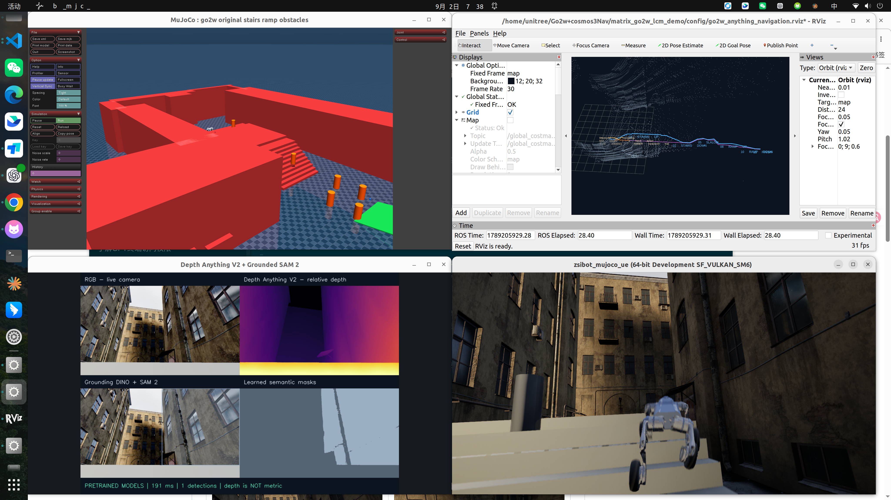
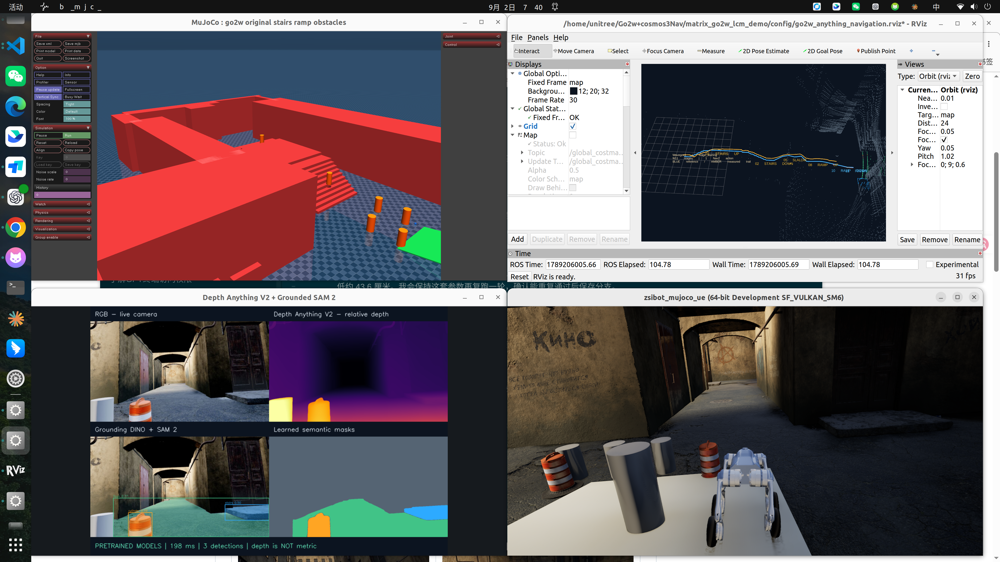
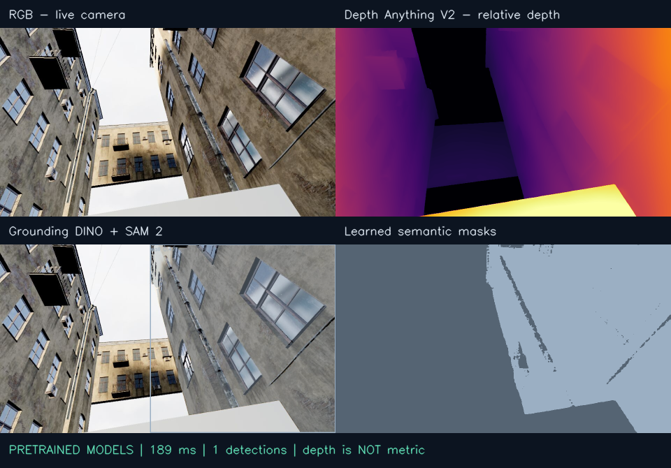

<div align="center">

# Wavegov1

**连续导航 · MID360 · 实时深度与语义 · 四窗口**

[返回 WAVE-Go](../../README.md) · [版本下载](https://github.com/vigorlee/wave-go/releases/tag/Wavegov1-baseline) · [完整验收](evidence/continuous_acceptance.json) · [依赖版本](snapshot.json)

</div>


2026-09-12 保存的本地复现版本。恢复直立安装的 **MID360**，关闭 UE 场景中的绿色扫描点，保留原 YardWorld 的上下楼梯、上下坡和固定圆柱障碍。没有增加额外楼梯或坡道。

## 本次实测

最终相同路线与控制参数，连续复跑 **2/2 通过**。每轮从起点执行上楼 → 下楼 → 固定障碍区 → 上坡 → 下坡 → 出口，全程一次 `NavigateThroughPoses`，中途不重发目标。

| 验证项 | 第 1 轮 | 第 2 轮 |
| --- | --- | --- |
| 阶段完成 | **11/11** | **11/11** |
| 导航任务 / 中途重发 | **1 / 0** | **1 / 0** |
| 用时 | **96.51 s** | **97.79 s** |
| 楼梯最高机身高度 | **2.049 m** | **2.047 m** |
| 上坡高度增量 | **44.60 cm** | **44.48 cm** |
| 下坡高度下降 | **44.33 cm** | **44.47 cm** |
| 坡脚 17.50–17.85 m 区段用时 | **1.56 s** | **1.79 s** |

[验收汇总](evidence/continuous_acceptance.json) · [第 1 轮结果与轨迹](evidence/continuous_run_1/) · [第 2 轮结果与轨迹](evidence/continuous_run_2/)。高度来自实际 `/odom/mujoco_odom`，通过判定同时检查阶段、任务返回与上下坡实际高度变化。本表只统计最终配置，两轮结果不代表长期成功率。

本次修复了三处衔接：楼梯小幅偏航时过早降速；楼顶回追身后的临时通过点；坡脚路径贴近原有桶。保留原地形，把坡脚绕行提前到下坡末段。调参期间存在失败运行，最终证据与旧版本历史结果分开保存。



实测原始与语义 MID360 在 12 秒内各收到 **120 个不同时间戳的帧**，约 **10.03 / 10.02 Hz**，单帧中位数 **20,001 点**，最长间隔 **0.138 / 0.151 s**。见 [本轮点云刷新记录](evidence/continuous_refresh_audit.json)。[61 项回归测试通过](evidence/tests.log)。另保留 [早期单独上楼记录](evidence/climb_result.json) 和 [模型采样统计](evidence/perception_summary.json) 供对照。



## 点云与语义来源

| 显示 / 话题 | 数据来源 |
| --- | --- |
| `/livox/lidar_raw` | MATRiX MID360 实际射线测量 |
| `/go2w/anything/mid360_points` | 原始测量几何 + 邻近 DINO / SAM2 语义关联；RViz 主显示 |
| `/go2w/anything/semantic_points` | UE 米制深度 + DINO / SAM2 掩膜；辅助语义投影 |
| `/go2w/anything/annotated_image` | RGB、Depth Anything V2 相对深度、DINO + SAM2 叠加、语义掩膜四面板 |
| `/livox/lidar` | 导航输入；原始雷达与已知场景圆柱几何融合，不能作为纯传感器评测 |

实际加载 Depth Anything V2 Small、Grounding DINO Tiny、SAM 2.1 Hiera Tiny。权重 revision 和 SHA-256 固定在 [manifest](runtime/models/anything/manifest.json)。Depth Anything 输出是相对逆深度，不能当作米制测距；SAM 掩膜类别来自 DINO，未用场景真值改写模型预测。

MID360 回调独立于模型推理，RViz `Decay Time: 0` 保留最新帧。[实际点云样本](evidence/mid360/) 提供下楼、平地和坡道的 NPZ 点坐标及标签。语义只在时间差 ≤ 0.6 秒且空间距离 ≤ 0.12 米时关联；过期或未匹配点为灰色 unknown。关闭的是 UE 调试扫描点，RViz 点云与语义分类仍正常发布。



<sub>实测模型输出：此帧主要识别到墙面，楼梯未稳定赋类。图像是运行结果，不能用来声称语义准确率已达标。</sub>

## 本机启动

已配置好的工作站直接运行：

```bash
cd /home/unitree/Go2w+cosmos3Nav/matrix_go2w_lcm_demo
bash scripts/start_go2w_wavegov1.sh
```

入口设置 `mid360`、`draw_points=false`、`random_scan=false`、10 Hz、安装角度 roll/pitch/yaw 均为 0。RGB 960×540 / 5 Hz，深度 640×480 / 5 Hz；出生点 `(0.65, 0)`，朝向 +Y。本版楼梯纠偏阈值 `GO2W_RL_STAIR_ALIGNMENT_MAX_HEADING=.40`、纠偏前进速度 `.70 m/s`，避免小幅偏航时降速卡在台阶；原有地形姿态与边界检查保留。默认显示 MuJoCo、RViz、模型四面板、UE 四个窗口，并执行原线路连续导航。蓝色为整条参考路线，紫色为实时 Nav2 全局路径，橙黄色为实际里程计轨迹。只重新排布窗口：

```bash
bash scripts/show_go2w_four_windows.sh
```

只观察四个窗口而不自动移动，使用 `bash scripts/start_go2w_three_scenes_live.sh`。下面的单项上楼测试仅在该观察模式、初始位置且没有其它导航任务时运行：

```bash
source /opt/ros/humble/setup.bash
source genisom_roamerx_open/install/setup.bash
export ROS_DOMAIN_ID=89 RMW_IMPLEMENTATION=rmw_zenoh_cpp
/usr/bin/python3 scripts/run_go2w_climb_live.py --output artifacts/Wavegov1_climb
```

脚本会设置 `up` 模式，发送上楼目标，记录里程计，完成后切回 `avoid` 并观察停稳。请从初始位置运行，不要在已有动作执行时同时发送第二个任务。

连续入口为 `scripts/start_go2w_wavegov1.sh`，通过 `go2w_continuous_course.py` 复用既有连续任务监督器，一次下发全部通过点，途中切换地形模式，不在每段终点停下重发目标。路线配置见 `config/go2w_wavegov1_route.json`，11 个验收阶段、11 个导航通过点。通过点在每次行为树 tick 检查；全局重规划 1 Hz，Nav2 通过半径 0.30 米；监督器阶段判定半径为 0.50 米，避免快速上楼时跳过目标判定。它直接执行用户选定的固定路线，不伪称为 Cosmos 实时推理结果。

出口绕行点提前靠右，下坡入口 `(0.90, 16.30)`、出口 `(1.10, 18.25)`，末端 `(1.10, 18.95)`，绕开坡脚原有的桶。场景几何未移动。每轮记录位于 `artifacts/Wavegov1_<时间>/course/`，包含 `result.json`、`events.jsonl`、`odom.csv` 和当轮配置副本。

停止当前演示：

```bash
systemctl --user stop go2w-course.service
systemctl --user stop go2w-anything-view.service go2w-anything-models.service go2w-navigation.service
bash scripts/stop_demo.sh
```

## 从 GitHub 恢复 Wavegov1

本目录保存的是可校验的源代码、配置及场景覆盖层。UE/MuJoCo 运行包、机器人网格、ROS 工作区安装产物与模型权重需在工作站已有；不包含这些大体积依赖。精确上游提交见 [snapshot.json](snapshot.json)，Python 核心依赖实测版本见 [perception-versions.txt](perception-versions.txt)。

```bash
git clone --branch Wavegov1-baseline --depth 1 https://github.com/vigorlee/wave-go.git wave-go-v1
cd wave-go-v1/demos/Wavegov1
export WAVE_GO_RUNTIME_ROOT=/home/unitree/matrix_go2w_lcm_demo

# 默认只校验 SHA-256 并显示差异，不写入运行目录。
python3 install_snapshot.py --runtime "$WAVE_GO_RUNTIME_ROOT"

# 停止运行后，恢复保存的源文件；已有不同文件自动备份到 .backups/。
python3 install_snapshot.py --runtime "$WAVE_GO_RUNTIME_ROOT" --apply
cd "$WAVE_GO_RUNTIME_ROOT"
bash scripts/build_demo.sh
bash scripts/start_go2w_wavegov1.sh
```

运行环境：Ubuntu 22.04 桌面 / X11、ROS 2 Humble、`rmw_zenoh_cpp`、MATRiX YardWorld、RoamerX、robot_forward、Go2-W DreamWaQ。C++ 构建需要 eCAL 5.13.3、Protobuf 3.12.4、LCM 1.5.1、zsibot_common 0.5.9 和 LibTorch；`TORCH_CMAKE_PREFIX`、`CUDACXX` 可覆盖本机默认路径。窗口脚本使用 DISPLAY `:0` 和 UID 1000 的 GDM Xauthority，其他桌面会话需调整这两个值。

模型使用独立 `.venv-anything`，Python 3.10、PyTorch 2.7.1 + CUDA 12.8、Transformers 4.57.6。保持 ROS 可用的 Python 环境，在 `models/anything/<模型名>` 放置 manifest 对应 revision 的 Hugging Face 模型文件。DreamWaQ 的 `actor_dwaq.pt` / `encoder_dwaq.pt` 位于 `third_party/DreamWaQ_Go2W/deploy/pre_train/g2wDWAQ/`。本次发布不重新分发这些权重。

运行测试：

```bash
source /opt/ros/humble/setup.bash
source genisom_roamerx_open/install/setup.bash
.venv-anything/bin/python -m unittest discover -s tests -q
```

## 本版边界

- 本版验收范围是原 YardWorld 短线路。仓库其它版本的 18/18 长程历史结果不能替代本次 11/11 验收。
- 已移除移动圆柱代理。YardWorld 原生行走人物替换和人体避障尚未完成，当前静态场景不宣称已支持动态行人。
- 恢复旧 MID360 未解决近地面扫描覆盖不足；模型仍可能误检、漏检，语义关联会出现 unknown。此次冻结不宣称这些质量问题已修复。
- Super-LIO 和 Go To Anything 没有接管定位或规划。实际控制链是 Nav2 / RoamerX → LCM → DreamWaQ；模型感知节点用于显示，不发布速度或导航目标。
- 旧实验中出现过 MuJoCo 正常退出后里程计中断；最终两轮完整线路与采样期间持续运行，不代表长时间稳定性已完成验证。

开发分支为 **Wavegov1**，用于后续迭代；`files.sha256.json` 校验本目录的运行文件与发布证据；Git tag **Wavegov1-baseline** 固定此次快照。

## 后续迭代

`Wavegov1` 是继续开发的分支，`Wavegov1-baseline` 标签固定本次验收代码。建议从该标签开新分支做实验，通过完整线路后再提交到开发分支；保留每轮 `course/result.json` 和轨迹，避免只凭画面判定成功。

```bash
git switch -c experiment/navigation Wavegov1-baseline
# 修改、构建并完整跑通后，再提交和推送该实验分支。
```
